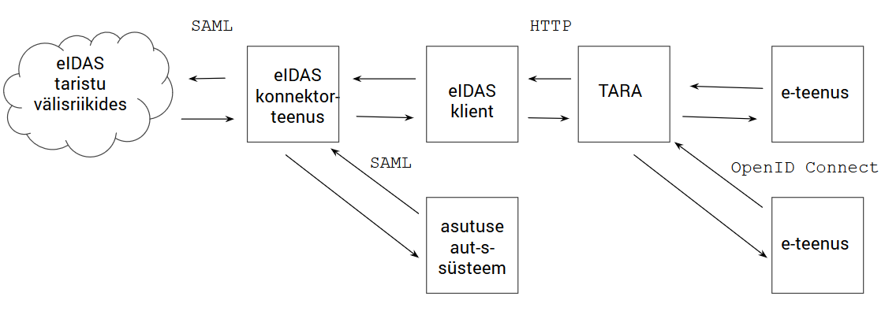

## Ahela turvalisus

Joonis 1

eIDAS autentimine tehakse ahelas, milles Eesti poolel on neli sõlme (joonis 1) ja välismaal veel kaks (välisriigi eIDAS vahendusteenus -> välisriigi autentimisteenus, joonisel esitatud koos, eIDAS taristu pilvena).

Joonistel 1 ja 2 on kujutatud autentimise voog. Autentimine algab kasutaja nupuvajutusega "Logi sisse" e-teenuses. Vasakule suunatud nooled kujutavad autentimispäringu liikumist välisriigi eIDAS-taristusse. Autentimistoiming tehakse ahela kõige vasakpoolsemas otsas. Paremale suunatud nooled kujutavad autentimisvastuse tagasiteed autentimise algatanud e-teenusesse.

Ahelas kasutatakse kahte autentimisprotokolli - SAML Web Browser SSO profiil [1] ja OpenID Connect (volituskoodi voog), kuid siin ei ole see oluline.

Joonisel kujutatu on lihtsustus, sest:
- TARAga ühendatakse mitmeid e-teenuseid
- eIDAS konnektorteenusega ühendatakse lisaks TARA-le veel RIK-i jt asutuste omi autentimislahendusi
- eIDAS konnektorteenus ise ühendub paljude EL liikmesriikide eIDAS vahendusteenustega.

End-to-end turvalisuse tagamiseks peame muuhulgas veenduma, et ahel koos püsiks ja autentimistoimingut kinnitav vastus jõuaks õigetesse kätesse. Muu hulgas tuleb tagada, et:
- sõlme saabunud autentimisvastus saadetakse edasi õigel tagasipöördumis-URL-l. Näiteks, asutuse autentimissüsteemist konnektorteenusesse tulnud autentimispäringu vastus peab jõudma tagasi asutuse autentimissüsteemi, mitte TARA-sse.
    - seega, sõlmel peab olema alus otsustada, millist tagasipöördumis-URL-i konkreetse autentimisvastuse korral rakendada
- autentimisvastus liigub seotult ühe ja seesama sirvimiskontekstiga (_browsing context_ - kasutaja sirvikus avatud sakk, aken või iframe).Kõik edastused tehakse sirviku ümbersuunamise (_redirect_) abil. (TARA ja e-teenuse vahel tehakse lisaks veel üks backend päring)
- kaitse taasesitusrünnete (_replay attacks_) vastu (vt [2]).

Nende eesmärkide saavutamiseks on järgmised mehhanismid (joonis 2):
- a) küpsised.
    - Ei OpenID Connect aga SAML protokoll tugine küpsiste kasutamisele. See ei tähenda, et küpsiseid ei võiks vajadusel, kasvõi täiendava kontrolli eesmärgil kasutada. Autentimispäringu edasisaatmisel võib sõlm anda sirvikule korralduse küpsise asetamiseks; autentimisvastuse saabudes haaratakse küpsis sirvikust kaasa. Küpsis peab olema `HttpOnly` ja `Secure` atribuutidega. Küpsise kasutamisel sõlm sisuliselt loob oma tarbeks seansi.
    - Küpsise kasutamisel peab arvestama, et küpsis seotakse sirvikuga, mitte kitsama sirvimiskontekstiga (saki, akna või iframe-ga). Ohtu võib-olla ei ole, kuid vaatlema peab ka (teoreetilist) juhtu, kus kasutaja algatab - võimalik, et mitmest sirvikust, kasutades mitme erineva riigi identiteete - üheaegselt mitu autentimistoimingut.
- b) vastavustabel vm mälu sõlmes, kus salvestatakse tagasipöördumis-URL või muud konkreetse autentimistoimingu oleku andmed
- c) autentimistoimingu identifikaatori (nonsi) edastamine autentimispäringus ja selle peegeldamine tagasi autentimisvastuses
    - elemendi `AuthnRequest` atribuut `ID` SAML autentimispäringus ja selle tagasipeegeldamine `InResponseTo` atribuudis autentimisvastuses
    - tagasipeegeldamine võib olla:
        - kogu ahelat hõlmav
            - eeldab usaldust ahela kõigi lülide vahel
        - ainult üht lüli või ahela osa hõlmav
    - peegeldatud väärtust tuleb kontrollida
- d) muu peegeldatav teave
    - SAML protokollis täidab seda ülesannet URL-i v POST-vormi element `RelayState`.
        - peab arvestama, et elementi `RelayState` ei allkirjastata.    

Joonis 2

[1] [Profiles for the OASIS Security Assertion Markup Language (SAML) V2.0](http://docs.oasis-open.org/security/saml/v2.0/saml-profiles-2.0-os.pdf)
[2] Paul Syverson (1994) [A Taxonomy of Replay Attacks](https://www.researchgate.net/publication/3560892_A_taxonomy_of_replay_attacks_cryptographic_protocols)
