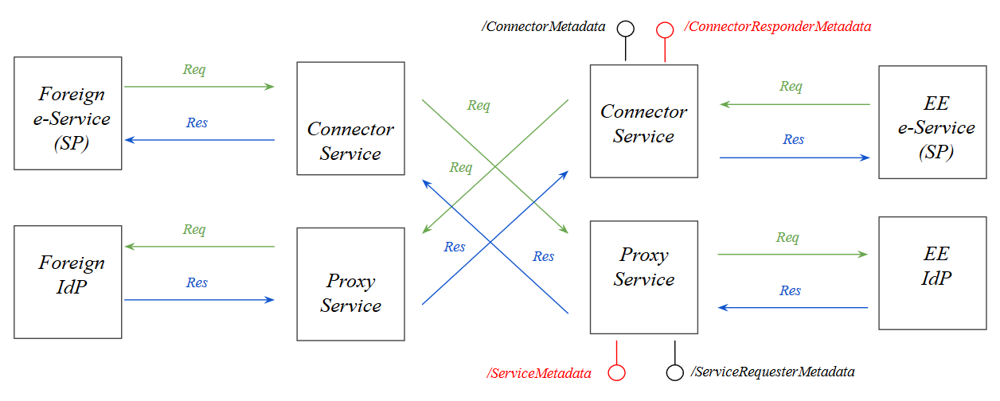

**ARHIVEERITUD** 
{:.teade}

## Atribuutide töötlusest

Väljakirjutusi eIDAS spetsifikatsioonist, joonis ja mõned järeldused Node-i metateabe otspunktide ja atribuutide töötluse kohta.

Allikad:
- [1] [eIDAS Interoperability Architecture](https://ec.europa.eu/cefdigital/wiki/download/attachments/46992719/eidas_interoperability_architecture_v1.00.pdf?version=1&modificationDate=1497252919857&api=v2)
- [2] [eIDAS Message Format v1.1-2](https://ec.europa.eu/cefdigital/wiki/download/attachments/46992719/eIDAS%20Message%20Format_v1.1-2.pdf?version=1&modificationDate=1497252919575&api=v2)
- [3] [eIDAS SAML Attribute Profile v1.1-2](https://ec.europa.eu/cefdigital/wiki/download/attachments/46992719/eIDAS%20SAML%20Attribute%20Profile%20v1.1_2.pdf?version=1&modificationDate=1497252920100&api=v2)

### Kohustuslikkus

_Kohustuslik atribuut_ - _mandatory attribute_ - [3], section 2.2.1, Natural person - the four required by the Regulation, Legal person - the two [3], section 2.3.1

***Valikuline atribuut*** - _optional attribute_ - "MAY be supplied by a MS if available and acceptable to national law" [3]

### Atribuudi toetus

[2], section 2.1.1 
"eIDAS-Services MUST support at least all mandatory attributes as specified in [eIDAS-Attr-Profile]. Optional attributes of [eIDAS-Attr-Profile] SHOULD be supported."

### Atribuutide toetuse publitseerimine

[2], section 2.1.1 
"eIDAS-Services MUST publish all their supported attributes as <saml:Attribute> elements in the <md:IDPSSODescriptor> element. Depending on the implementation and deployment of eIDAS-Services, this can result in the publication of a union of supported attributes."

Eesti Node-i vahendusteenus (Proxy Service) publitseerib Eesti autentimisteenuse poolt toetatud atribuudid metateabe otspunktis `/ServiceMetadata` (nimi on Node-is seadistatav):

[https://eidastest.eesti.ee/EidasNode/ServiceMetadata](https://eidastest.eesti.ee/EidasNode/ServiceMetadata)

Kui vahetame testkeskkonnas Demo-IdP meie IdP (RW tehtu) vastu välja, siis peame `/ServiceMetadata` ka vastavalt ümber seadistama. S.t eemaldama kõik atribuudid, v.a need, mida suudame pakkuda. Atribuutide toetust, paistab, et saa seadistada failis `EIDAS-Config/server/idp/saml-engine-eidas-attributes.xml`.

Märkus. Konnektorteenus publitseerib ka atribuutide toetust - metateabe otspunktis `/ConnectorResponderMetadata`:

[https://eidastest.eesti.ee/EidasNode/ConnectorResponderMetadata](https://eidastest.eesti.ee/EidasNode/ConnectorResponderMetadata)

eIDAS Node-i tegijad on mõelnud nii, et:
- teenusepakkuja (SP) tõmbab otspunktist `/ConnectorResponderMetadata` loetelu atribuutidest, mida välisriikidest üldse saab küsida
- teenusepakkuja (SP) moodustab päringu, valides eelmises punktis saadud loetelust soovitavad atribuudid
- teenusepakkuja (SP) võib kindlaks teha isiku riigi; võib selle aga jätta ka konnektorteenuse teha
- konnektorteenus tõmbab soovitud riigi vahendusteenuse (Proxy Service) metateabe otspunktist (`/ServiceMetadata` või vastav) välisriigi poolt toetatud atribuutide loetelu
- konnektorteenus kontrollib, eelmises sammus saadud loetelu alusel (loetelu võib puhverdada) kas välisriik suudab päringus kohustuslikena nõutud `IsRequired' atribuute tarnida; kui ei suuda, siis ei saada päringut edasi.

### Atribuutide nõudmine päringus

[2], section 2.3.2 "Requesting Attributes"

"Requesting attributes by an eIDAS-Connector from an eIDAS-Service MUST be carried out dynamically by including them in a <saml2p:AuthnRequest>."

"Only attributes that are published in the SAML metadata of the eIDAS-Service can be requested by an eIDAS-Connector (see Section 2.1.1)."

"Attributes requested that are not supported by an eIDAS-Service MUST be ignored by the eIDAS-Service."

"Attributes MUST be requested as <eidas:RequestedAttributes>."

"For attributes requested and being mandatory according to the eIDAS minimum data sets and [eIDAS-Attr-Profile] the attribute isRequired of <eidas:RequestedAttribute> MUST be set to “true”." For all optional attributes according to the eIDAS minimum data sets and [eIDAS-Attr-Profile] the attribute isRequired of <eidas:RequestedAttribute> MUST be set to “false”."

"When requesting a minimum data set, at least all attributes defined as mandatory within this minimum data set MUST be requested."

"At least one minimum data set MUST be requested in each <saml2p:AuthnRequest>."

### Atribuutide nõude töötlemine

[2], section 2.3.3 "Responding Attributes"

"Attributes MUST NOT contain empty values." 

"For representation cases (e.g. a natural person representing a legal person) the SAML response MAY contain attributes of a representative not requested."
