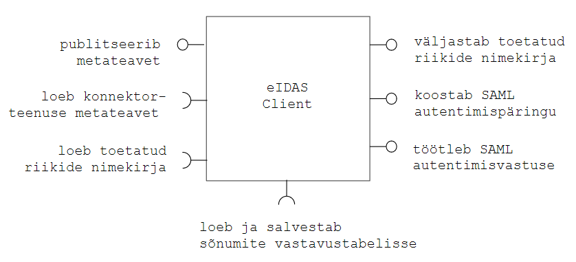

# eIDAS Client mikroteenusena
{: .no_toc}
v 0.2, 22.02.2018

- TOC
{:toc}

## 1 Ülevaade

[eIDAS Client](https://github.com/e-gov/eIDAS-Client) on tarkvara, mis aitab teostada e-teenuse (nimetame ka teenusepakkujaks) liidest RIA eIDAS konnektorteenusega. eIDAS Clienti võib kasutada kolmel viisil:
- eIDAS Client teegi lõimimisega e-teenuse tarkvarasse
- paigaldamisega ja kasutamisega mikroteenusena
- demorakendusena.

Käesolev dokument käsitleb eIDAS Client kasutamist mikroteenusena. Kirjeldame eIDAS Client mikroteenuse olulised omadused, liidesed ja töötlusloogika ja mikroteenuse paigaldamiseks muu olulise. Kirjeldus on koostatud TARA silmas pidades, kuid käsitlus kehtib ka muudele sama mustriga kasutustele.

Miks kasutada eIDAS Clienti mikroteenusena? Võimaldab:
- vältida sõltuvuskonflikte (eIDAS Clienti ja e-teenuse alusteekide vahel)
- hoida e-teenus vaba SAML sõnumitöötlusest.
- vähendada eIDAS loogika e-teenusesse sissekirjutamise vajadust
- hoida asju lihtsana (mikroteenust iseloomustab: 1) selgepiirilisus - väike arv, selgepiirilisi liideseid; pakub konkreetset, lihtsalt hoomatavat teenust; 2) suhteline sõltumatus - väike arv sõltuvusi; eraldi paigaldatavus)

Samas ei tähenda mikroteenus järeleandmisi turvalisusele,dokumenteerimisele, testimisele jm arendus- ja käitlusnõuetele.

## 2 Käitlusomadused

eIDAS Client mikroteenuse käitluse seisukohalt tähtsamad omadused (infoturve vt jaotis 2):

_omadus_ | _väärtus_ | _selgitus_
olek | _stateless_ | ei kasuta andmebaasi ega muud püsimälu
otspunkte | 4 + 2 | pakub 4, ise kasutab 2
protokoll(id) | HTTP(S) |
avatud pöördumistele välisvõrgust | jah | `/metadata` otspunkt, vt allpool
pöördub välisvõrku | jah | RIA konnektorteenuse metateabe (`/ConnectorResponderMetadata`) ja toetatud riikide nimekirja poole. (TARA puhul pöördumised ei tarvitse väljuda välisvõrku)
kasutajaliides (UI) | ei | otsesuhtlus kasutajaga (sirvikuga) puudub 
seadistus | seadistusfaili abil, vt allpool 
logimine | ei | // TODO Analüüsida logimise vajadust //
isikuandmete töötlus | töödeldakse, teenusepakkuja poolt kasutatava eIDAS autentimisteenuse kontekstis
testimine |   | // TODO //

## 3 Infoturve 

Ligipääsu `/login` ja `/AuthRes` otspunktidele tohib anda ainult teenusepakkujale (s.t sisevõrgus olevale rakendusele).  Kaitstakse HTTPS-ga, sertidega ja usaldusankru seadmisega mikroteenuse seadistuses.

Ligipääs otspunktile `/metadata` ei vaja piiramist (metateave on avalik).

## 4 Liidesed

eIDAS Client mikroteenusena pakub ja tarbib järgmisi otspunkte (joonis 1). Otspunktid on spetsifitseeritud allpool. 

Joonis 1. eIDAS Client liidesed

Tabel 4.1 eIDAS Client liidesed

|  nr  |  pakub/kasutab  |  välis- v siseliides | protokoll [, meetod] |  URL v selle osa  | selgitus | ligipääs |
|:----:|:---------------:|:--------------------:|:----------------------:|:-----------------:|-------------|------|
| 1 | pakub | välis | HTTPS, `GET` | `/metadata` | Otspunkt pakub e-teenuse SAML metateavet, vastavalt [RIA eIDAS konnektorteenuse spetsifikatsiooni nõuetele](https://e-gov.github.io/eIDAS-Connector/Spetsifikatsioon) | avalik |
| 2 | pakub | sise | HTTP(S), `GET` | `/login` | Tagastab eIDASe toetatud riikide nimekirja. | ainult teenusepakkujal |
| 3 | pakub | sise | HTTP(S), `POST` | `/login` | Moodustab SAML autentimispäringusõnumi. Parameetrid ja töötlusloogika vt allpool. | ainult teenusepakkujal |
| 4 | pakub | sise | HTTP(S), `POST` | `/AuthRes` | Töötleb SAML autentimisvastussõnumi. | ainult teenusepakkujal |
| 5 | kasutab | välis | HTTPS, `GET` | `/ConnectorResponderMetadata` | Loeb RIA eIDAS konnektorteenuse metateavet | avalik |

Tabel 4.2 HTTP(S) `POST` `/login` parameetrid

| parameetri nimi        | kohustuslik           | selgitus  |
|:-------------:|:-------------:| :-----|
| `Country` |	Jah | Kohustuslik POST meetodi puhul. Parameeter määrab ära tuvastatava kodaniku riigi. Väärtus peab vastama [ISO 3166-1 alpha-2](https://en.wikipedia.org/wiki/ISO_3166-1_alpha-2) standardis toodule. |
| `LoA` |	Ei | Parameeter, mis määrab ära nõutava isikutuvastuse taseme. Lubatud väärtused: `substantial`, `high`.  Kui parameeter on määramata, siis vaikimisi loetakse väärtuseks `substantial`. |
| `RelayState` |	Ei | Parameeter, mis saadetakse edasi konnektorteenusele muutmata kujul. Väärtus peab vastama regulaaravaldisele `[a-zA-Z0-9-_]{0,80}`. |

Tabel 4.3 HTTP(S) `POST` `/AuthRes`

| parameetri nimi        | kohustuslik           | selgitus  |
| ------------- |:-------------:| :-----|
| `SAMLResponse` | Jah | Base64-kodeeritud SAML `Response` sõnum. Vastus peab olema allkirjastatud ja isiku kohta käivad väited krüpteeritud (eIDAS Node privaatvõtmega). |
| `RelayState` | Ei | Päringuga saadetud `RelayState` parameetri väärtus. |

## 5 Seadistus

Tabel 5.1 Teenusepakkuja metateabe seadistus

| Parameeter        | Kohustuslik | Kirjeldus, näide |
| :---------------- | :---------- | :----------------|
| `eidas.client.keystore` | Jah | Võtmehoidla asukoht. Peab olema JKS tüüpi. classpath:samlKeystore.jks |
| `eidas.client.keystorePass` | Jah | Võtmehoidla parool. |
| `eidas.client.metadataSigningKeyId` | Jah | SAML metateabe allkirjastamisvõtme alias. |
| `eidas.client.metadataSigningKeyPass` | Jah | SAML metateabe allkirjastamisvõtme parool. |
| `eidas.client.requestSigningKeyId` | Jah | SAML autentimispäringu allkirjastamisvõtme alias. |
| `eidas.client.requestSigningKeyPass` | Jah | SAML autentimispäringu allkirjastamisvõtme parool. |
| `eidas.client.responseDecryptionKeyId` | Jah | SAML autentimisvastuse dekrüpteerimisvõtme alias. |
| `eidas.client.responseDecryptionKeyPass` | Jah | SAML autentimisvastuse dekrüpteerimisvõtme parool. |
| `eidas.client.spEntityId` | Jah | `/md:EntityDescriptor/@Issuer` väärtus metateabes. Näiteks: https://hostname:8889/metadata |
| `eidas.client.callbackUrl` | Jah | `/md:EntityDescriptor/md:SPSSODescriptor/md:AssertionConsumerService/@Location` väärtus metateabes. |

Tabel 5.2 Konnektorteenuse metateabe seadistus

| Parameeter        | Kohustuslik | Kirjeldus, näide |
| :---------------- | :---------- | :----------------|
| `eidas.client.idpMetadataUrl`  | Jah | Konnektorteenuse metateabe asukoht. https://eidastest.eesti.ee/EidasNode/ConnectorResponderMetadata |
| `eidas.client.idpMetadataSigningCertificateKeyId` | Ei | Konnektorteeenuse metateabe allkirjastamiseks kasutatud sertifikaadi alias võtmehoidlas. Vaikimisi alias: `metadata`. |

Tabel 5.3 AuthnRequesti seadistus

| Parameeter        | Kohustuslik | Kirjeldus, näide |
| :---------------- | :---------- | :----------------|
| `eidas.client.providerName` | Jah | `/saml2p:AuthnRequest/@ProviderName` väärtus. |

