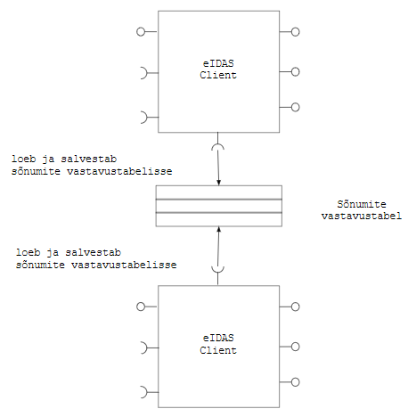

**ARHIVEERITUD** 
{:.teade}

# eIDAS Client mikroteenus
{: .no_toc}
v 0.3, 28.02.2018

- TOC
{:toc}

## 1 Ülevaade

[eIDAS Client](https://github.com/e-gov/eIDAS-Client) on tarkvara, mis hõlbustab e-teenuse (teenusepakkuja) liidestamist RIA eIDAS konnektorteenusega. eIDAS Client-i võib kasutada kolmel viisil:
- paigaldamisega ja kasutamisega mikroteenusena
- eIDAS Client teegi lõimimisega e-teenuse tarkvarasse
- demorakendusena.

Käesolev dokument käsitleb eIDAS Client kasutamist mikroteenusena. Kirjeldame eIDAS Client mikroteenuse olulised omadused, liidesed ja töötlusloogika ning mikroteenuse paigaldamiseks olulise. Kirjeldus on koostatud TARA silmas pidades, kuid kehtib ka muudele sama mustriga kasutustele.

## 2 Funktsioon

eIDAS Client mikroteenus:
1. publitseerib konnektorteenusega suhtluseks vajaliku metateabe
2. loeb ise konnektorteenuse metateabe otspunktist metateavet
3. loeb konnektorteenuse teisest otspunktist toetatud riikide nimekirja
4. edastab teenusepakkujale toetatud riikide nimekirja
5. moodustab nõuetekohase SAML autentimispäringu, sh allkirjastab
6. töötleb konnektorteenuselt saadud SAML autentimisvastust - kontrollib allkirja, dekrüpteerib ja teisendab hõlpsamini tarbitavale JSON-kujule
7. loeb ja salvestab teavet sõnumite vastavustabelisse. 

eIDAS Client mikroteenus seadistatakse teenindama ühtainust teenusepakkujat. SAML autentimispäringut allkirjastades tegutseb mikroteenus teenusepakkuja nimel.

eIDAS Client mikroteenus on paigaldatav mitmes instantsis. Instantsid kasutavad ühist sõnumite vastavustabelit. Teenindatav teenusepakkuja võib olla paigaldatud mitmes instantsis.

Teenusepakkuja ülesandeks eIDAS Client-i kasutamisel on:
- küsida kasutajalt kust riigist ta tuleb ja edastada valik koos minimaalse tagatistasemega eIDAS Client-le
- eIDAS Client-i poolt koostatud autentimispäringu edastamine konnektorteenusele (läbi sirviku, ümbersuunamiskorraldusega)
- autentimisvastuse vastuvõtmine konnektorteenuselt ja edastamine eIDAS Client-le töötlemiseks
- töödeldud autentimistulemuste vastuvõtmine eIDAS Client-lt (ja seejärel - eduka isikutuvastuse korral - kasutajaga seansi loomine).

## 3 Pakutavad ja tarbitavad liidesed

eIDAS Client mikroteenus pakub ja tarbib järgmisi liideseid (otspunkti täpsusega). Detailsem  kirjeldus vt allpool. 

## 4 Omaduste ülevaade

eIDAS Client mikroteenuse tähtsamad omadused:

| _omadus_ | _väärtus_ | _selgitus_ |
|----------|:---------:|-------------|
| olek | _stateful_ | kasutab sõnumite vastavustabelit, vt allpool | 
| otspunkte | 7 | pakub 4, ise kasutab 3 | 
| protokoll(id) | SAML üle HTTPS (metateave), JSON üle HTTPS | 
| avatud pöördumistele välisvõrgust | jah | metateabe publitseerimise otspunkt, vt allpool | 
| pöördub välisvõrku | jah | RIA konnektorteenuse metateabe (`/ConnectorResponderMetadata`) ja toetatud riikide nimekirja poole. (TARA puhul pöördumised ei tarvitse väljuda välisvõrku) | 
| kasutajaliides (UI) | ei | otsesuhtlus kasutajaga (sirvikuga) puudub | 
| seadistus | jah | seadistusfaili abil, vt allpool. Seadistuse osaks on privaatvõti, sert ja usaldusankur. | 
| logimine | ei | // TODO Analüüsida logimise vajadust // | 
| isikuandmete töötlus | jah | töödeldakse, teenusepakkuja poolt kasutatava eIDAS autentimisteenuse kontekstis | 
| testimine | jah | // TODO Siduda // | 

## 5 Sõnumite vastavustabel

Sõnumite vastavustabel on vajalik SAML autentimisvastuse kontrollimiseks.

SAML [autentimispäringusse](Spetsifikatsioon#6-autentimispäring) (`AuthnRequest`) pannakse identifikaator `ID` (päringu identifikaator).
SAML [autentimisvastuses](Spetsifikatsioon#7-autentimisvastus) (`AuthnResponse`), väljas `InResponseTo` tuleb sama identifikaator tagasi. Autentimisvastuse saamisel tuleb muu hulgas kontrollida, et:
- väljas `InResponseTo` oleva identifikaatoriga autentimispäring üldse saadeti
- ja vastamisaeg ei ole täis saanud
- ja vastust ei ole juba töödeldud (kaitse taasesitusründe vastu).

Selleks on vaja väljasaadetud autentimispäringute identifikaatoreid meeles pidada.

Märkus. eIDAS tehhniline spetsifikatsioon otseselt ei nõua, kuid võimalusel peaksime päringu identifikaatori panema ka küpsisena kasutaja sirvikusse. Autentimiselt tagasi tulles peaksime kontrollima, et küpsises olev väärtus langeks kokku autentimisvastuse `InResponseTo` väärtusega. Nii saaksime kaitse sõnumite "ristimineku" vastu. Kui teostus osutub keerukaks, siis võib ka loobuda.

Nimetatud kontrollide võimaldamiseks tuleb pidada sõnumite vastavustabelit. Vastavustabel on järgmise struktuuriga:

| ID | saatmisaeg  | vastus kätte saadud |
|:--:|:-----------:|:----------------:|
| 123 | timestamp  |   `false`          |

... 

Autentimispäringu saatmisel lisatakse tabelisse kirje, kuhu märgitakse ID ja saatmisaeg. Autentimisvastuse töötlemisel leitakse tabelist vastav kirje, kontrollitakse, kas vastus ei ole aegunud ja märgitakse vastus kättesaaduks.

Vastavustabeli võib lahendada _in-memory_ struktuuriga. Võrdluseks, eIDAS konnektorteenuses (kus samuti vastavustabelit peetakse) on kasutusel Java Hashtable. Kui soovime eIDAS Client-i paigaldada mitmes instantsis, siis tuleb vastavustabel teostada ühiskasutatava, transaktsioone toetava mälulahendusega (andmebaasiga). 

## 6 Kõrgkäideldavus

Üldine nõue on, et kõik arendatavad komponendid, v.a andmebaasid, oleksid paigaldatavad mitmes instantsis.

eIDAS Client-i puhul tuleb siiski arvestada, et koormuse jagamise reaalne vajadus on kaheldav. Me ei ennusta välismaalaste nii suurt tungi meie e-teenustesse, vähemalt esialgu. Teenuse katkestuse vältimine, automaatne _hot switching_ on ehk tähtsam motiiv. Kuid ka siin saaks lahendada ehk varuinstantsi hoidmisega ja selle aktiveerimisega süsteemiadministraatori poolt käsitsi põhinstantsi tõrke korral. 

Vaatamata sellele tuleks komponendid arendada selliseks, et mitmes instantsis, _hot switching_ kasutamine oleks võimalik. eIDAS Client-i puhul see on võimalik. eIDAS Client saab mitmes instantsis paigaldada (vt järgnev joonis).

 Instantsid peavad kasutama ühist vastavustabelit. Ühise vastavustabeli saab teostada andmebaasiga.

## 7 Usaldus eIDAS Client-i ja teenusepakkuja vahel

eIDAS Client allkirjastab SAML autentimispäringu, teenusepakkuja privaatvõtmega ja teenusepakkuja nimel. Autentimisvastuse töötlemisel eIDAS Client dekrüpteerib autentimisvastuse, kasutades teenusepakkuja privaatvõtit. Need on tundlikud, kaitset vajavad toimingud. Autentimispäringu koostamise ja autentimisvastuse töötlemise otspunktidele tohib juurdepääs olla ainult teenusepakkujal (eIDAS Client-i kasutamisel TARA-s - TARA Serveril).

eIDAS Client paigaldatakse teenusepakkujaga samas sisevõrgus. Kuid ka siis tuleb ühendust kaitsta. Ühendus tuleb teha HTTPS-ga, vastastikuse autentimisega (_mutual authentication_). Otstarbekas on kasutada asutuse sisemise usaldusteenuse pakkuja (_enterprise CA_) serte. Võtmete ja sertide paigalduse plaan (PEM-failide nimetustes `server` ja `client` väljendavad eIDAS Client-i toimimist HTTP serveri rollis teenusepakkuja suhtes):

|                      |  eIDAS Client    | teenusepakkuja |
| privaatvõti            |  `server-key.pem`  | `client-key.pem` |
| sert                   |  `server-crt.pem`  | `client-crt.pem` |
| usaldusankur (CA sert) |  `ca-crt.pem`      | `ca-crt.pem`  |

Kuna CA võib serte välja anda ka teistele rakendustele, siis tuleb kontrollida ka serdis määratud nime (CN). Tühistusnimekirja (CRL) kasutamine ei ole vajalik.

Ligipääs metateabe publitseerimise otspunktile ei vaja piiramist, sest metateave on avalik.

## 8 Liideste spetsifikatsioon

### 8.1 Ülevaade

|  nr  |  pakub/kasutab  |  välis- v siseliides | protokoll [, meetod] |  URL v selle osa  | selgitus | ligipääs |
|:----:|:---------------:|:--------------------:|:----------------------:|:-----------------:|-------------|------|
| 1 | pakub | välis | HTTPS, `GET` | `/metadata` | Otspunkt pakub e-teenuse SAML metateavet, vastavalt [RIA eIDAS konnektorteenuse spetsifikatsiooni nõuetele](https://e-gov.github.io/eIDAS-Connector/Spetsifikatsioon) | avalik |
| 2 | pakub | sise | HTTP(S), `GET` | `/login` | Tagastab eIDASe toetatud riikide nimekirja. | ainult teenusepakkujal |
| 3 | pakub | sise | HTTP(S), `POST` | `/login` | Moodustab SAML autentimispäringusõnumi. Parameetrid ja töötlusloogika vt allpool. | ainult teenusepakkujal |
| 4 | pakub | sise | HTTP(S), `POST` | `/AuthRes` | Töötleb SAML autentimisvastussõnumi. | ainult teenusepakkujal |
| 5 | kasutab | välis | HTTPS, `GET` | `/ConnectorResponderMetadata` | Loeb RIA eIDAS konnektorteenuse metateavet | avalik |

### 8.2 `POST` `/login`

Sisend:

| parameetri nimi        | kohustuslik           | selgitus  |
|:-------------:|:-------------:| :-----|
| `Country` |	Jah | Kohustuslik POST meetodi puhul. Parameeter määrab ära tuvastatava kasutaja riigi. Väärtus peab vastama [ISO 3166-1 alpha-2](https://en.wikipedia.org/wiki/ISO_3166-1_alpha-2) standardis toodule. |
| `LoA` |	Ei | Parameeter, mis määrab ära nõutava isikutuvastuse taseme. Lubatud väärtused: `substantial`, `high`, `low`.  Kui parameeter on määramata, siis vaikimisi loetakse väärtuseks `low`. |
| `RelayState` |	Ei | Parameeter, mis saadetakse edasi konnektorteenusele muutmata kujul. Väärtus peab vastama regulaaravaldisele `[a-zA-Z0-9-_]{0,80}`. |

Väljund:

// TODO JSON-struktuur saatmisvalmis URL-i ja POST-päringu kehaga? //

// TODO Näide. Või viidata konnektorteenuse speki näitele? //

### 8.3 `POST` `/AuthRes`

Sisend:

| parameetri nimi        | kohustuslik           | selgitus  |
| ------------- |:-------------:| :-----|
| `SAMLResponse` | Jah | Base64-kodeeritud SAML `Response` sõnum. Vastus peab olema allkirjastatud ja isiku kohta käivad väited krüpteeritud (eIDAS Node privaatvõtmega). |
| `RelayState` | Ei | Päringuga saadetud `RelayState` parameetri väärtus. |

Väljund:

// TODO - JSON-struktuur? //

// TODO Näide //

## 9 Seadistus

Teenusepakkuja metateabe seadistus

| Parameeter        | Kohustuslik | Kirjeldus, näide |
| :---------------- |:----------:| :----------------|
| `eidas.client.keystore` | Jah | Võtmehoidla asukoht. Peab olema JKS tüüpi. classpath:samlKeystore.jks |
| `eidas.client.keystorePass` | Jah | Võtmehoidla parool. |
| `eidas.client.metadataSigningKeyId` | Jah | SAML metateabe allkirjastamisvõtme alias. |
| `eidas.client.metadataSigningKeyPass` | Jah | SAML metateabe allkirjastamisvõtme parool. |
| `eidas.client.requestSigningKeyId` | Jah | SAML autentimispäringu allkirjastamisvõtme alias. |
| `eidas.client.requestSigningKeyPass` | Jah | SAML autentimispäringu allkirjastamisvõtme parool. |
| `eidas.client.responseDecryptionKeyId` | Jah | SAML autentimisvastuse dekrüpteerimisvõtme alias. |
| `eidas.client.responseDecryptionKeyPass` | Jah | SAML autentimisvastuse dekrüpteerimisvõtme parool. |
| `eidas.client.spEntityId` | Jah | `/md:EntityDescriptor/@Issuer` väärtus metateabes. Näiteks: https://hostname:8889/metadata |
| `eidas.client.callbackUrl` | Jah | `/md:EntityDescriptor/md:SPSSODescriptor/md:AssertionConsumerService/@Location` väärtus metateabes. |

Konnektorteenuse metateabe seadistus

| Parameeter        | Kohustuslik | Kirjeldus, näide |
| :---------------- | :---------- | :----------------|
| `eidas.client.idpMetadataUrl`  | Jah | Konnektorteenuse metateabe asukoht. https://eidastest.eesti.ee/EidasNode/ConnectorResponderMetadata |
| `eidas.client.idpMetadataSigningCertificateKeyId` | Ei | Konnektorteeenuse metateabe allkirjastamiseks kasutatud sertifikaadi alias võtmehoidlas. Vaikimisi alias: `metadata`. |

AuthnRequesti seadistus

| Parameeter        | Kohustuslik | Kirjeldus, näide |
| :---------------- | :---------- | :----------------|
| `eidas.client.providerName` | Jah | `/saml2p:AuthnRequest/@ProviderName` väärtus. |

## 10 Miks kasutada eIDAS Clienti mikroteenusena

Mikroteenus võimaldab:
- vältida sõltuvuskonflikte (eIDAS Clienti ja e-teenuse alusteekide vahel)
- hoida e-teenus vaba SAML sõnumitöötlusest, sh sellega seotud võtmehaldusest ja keerukast seadistamisest
- hoida eIDAS loogika teenusepakkujasse sissekirjutamist minimaalsena
- hoida üldiselt asju lihtsana (mikroteenust iseloomustab: 1) selgepiirilisus - väike arv, selgepiirilisi liideseid; pakub konkreetset, lihtsalt hoomatavat teenust; 2) suhteline sõltumatus - väike arv sõltuvusi; eraldi paigaldatavus).

Mikroteenus ei tähenda järeleandmisi turvalisusele,dokumenteerimisele, testimisele jm arendus- ja käitlusnõuetele.
