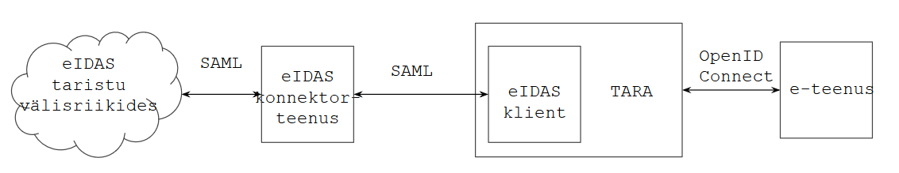
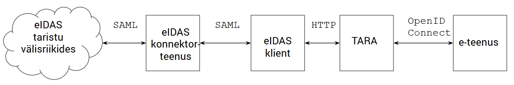
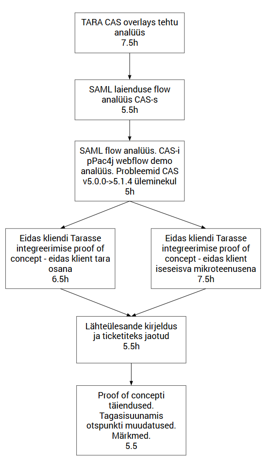

BEST PRACTICE

# Kes on Javier Garcia?

Javier Garcia on eIDAS testisik. Kõik võib-olla ei tea, et aasta algusest käivad meil EL piiriülese autentimistaristu eIDAS Eesti otsa arendustööd.

Nortali arendajad said neil päevil käima ahela, milles on tervelt kuus sõlme: Eesti e-teenust etendav makettrakendus -> autentimisteenus TARA -> eIDAS klient -> RIA eIDAS konnektorteenus -> CEF eIDAS Node (Brüsselis) -> CEF eIDAS Validator.

Traageldatud, aga juba läbi katsetatud - välismaalase saatmine meie e-teenusest autentimisele ja autenditult tagasitulek on teostatav. Seni veel igasuguste kontrollideta ja kõik tuvastatud isikud saavad nime Javier Garcia.  

Tööd ja tehnilist keerukust on ees veel palju. Siiski saime kõvasti kindlust juurde, et suudame piiriülese autentimise tähtajaks (september 2018) valmis teha.

Üks huvitav moment. Raske küsimus on kuidas siseriiklik TARA-teenus eIDAS konnektorteenusega ühendada. See on erinevate protokollide, erinevate teekide, sama teegi erinevate versioonide tõttu olnud tõeliselt keerukas. Väga raske otsustada, kas:

a) eIDAS-klient paigutada TARA sisse

või 

b) teha eIDAS-klient eraldi mikroteenusena?

Nortali mehed tegid küsimuse selgitamiseks kaks POC-i e katserakendust (Proof of Concept). Võib küsida, kas oli mõtet programmeerida kahte erinevat varianti? Oli küll, sest katserakenduste käitamine näitas variandi a sobimatust - teekide konfliktid, probleemid rakenduse voo kohandamisel jm. Kui vaatate allolevalt plokkskeemilt, siis arhitektuurilist otsust ei olnudki enam vaja teha. Faktide loogikast koorus otsus ise välja. 

Teemaga haakub ettevalmistatav A/B testimise metoodika hange. Eesti.ee baasil tahame riigi IT arenduspraktikasse sisse tuua idufirmades populaarse tehnika, milles otsustavad faktid, mitte disainerid-arhitektid.