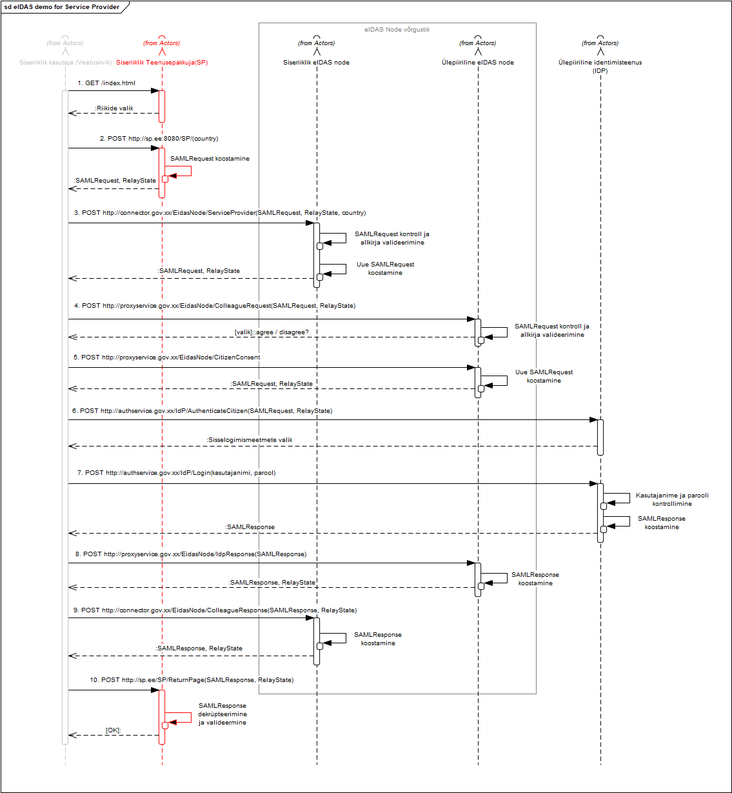

Märkus. Lahtised küsimused on markeeritud sümbolitega `//`. 
{:.teade}

# RIA eIDAS konnektorteenuse spetsifikatsioon
{: .no_toc}
v 0.9

- TOC
{:toc}

## 1 Ülevaade

Käesolev spetsifikatsioon on suunatud riigiasutusele, edaspidi *teenusepakkuja*, kes soovib oma e-teenuse välismaalastest kasutajaid autentida eIDAS konnektorteenuse abil.

Spetsifikatsioon:
- annab tehnilise ülevaate autentimisprotsessist
- määratleb liidestatavatele süsteemidele esitatavaid nõuded
- ja annab soovitusi liidese ehitamiseks.

## 2 Tehnilised parameetrid

- protokoll
    - SAML 2.0, Web Browser SSO profiil, koos eIDAS täiendustega. Vt [Viited](Viited), eIDAS Technical specification
- sõnumivahetusmeetod
    - `HTTP POST`, kasutaja sirviku ümbersuunamise (_redirect_) abil. Vt [Viited](Viited), "HTTP POST binding" SAML 2.0 standardikirjelduses, ptk 5.12.
- otspunktid
    - metateabe otspunkt `/ConnectorResponderMetadata`
    - SAML autentimispäringsõnumite vastuvõtupunkt `/ServiceProvider`

- Märkus. Teenusepakkuja peab omama (vt joonis 1):
    - metateabe otspunkti, nt `/Metadata`
    - SAML autentimisvastussõnumite vastuvõtupunkti, nt `/ReturnPage`.


Joonis 1. Metateabe otspunktid (punasega) ja SAML sõnumite vastuvõtupunktid

## 3 Nõuded liitujale

Kokkuvõtlikult peab teenusepakkuja:
- pakkuma SAML metateabe otspunkti teenust
- omama SAML päringute ja vastuste töötlemise võimekust.

1. teenusepakkuja peab koostama oma süsteemi kohta metateabe, vastavalt eIDAS-e nõuetele (vt jaotis [Teenusepakkuja metateave](#teenusepakkuja-metateave))
2. metateabe transport teisele osapoolele
    1. konnektorteenuse metateave publitseeritakse HTTPS otspunktis:
        - [https://eidastest.eesti.ee/EidasNode/ConnectorMetadata](https://eidastest.eesti.ee/EidasNode/ConnectorMetadata) (testkeskkond)
        - [https://eidas.eesti.ee/EidasNode/ConnectorMetadata](https://eidas.eesti.ee/EidasNode/ConnectorMetadata) (toodangukeskkond)
    2. teenusepakkuja publitseerib metateabe samuti HTTPS otspunktis
        - teatab otspunkti RIA-le
    3. soovi korral annab osapool (tulemüüriga) juurdepääsu metateabele ainult partnerile
    4. täiendavate metateabe transpordi kaitsemeetmete (IPSec, VPN) toetus põhjendatud turvavajaduse korral, läbirääkimisega RIA-ga
    5. manuaalne vm _out of band_ metateabe edastus - ei ole toetatud
3. metateabe allkirjastamine
    1. on kohustuslik
    2. allkirja tuleb metateabe võtmisel valideerida, kogu usaldusahela ulatuses
    3. usaldusankruks SK ID Solutions AS juursert
    4. toetama peab samu algoritme, mis p 7
4. metateabe uuendamine
    1. osapool võib metateavet puhverdada, kuni `md:EntityDescriptor` atribuudis `validUntil` määratud ajamomendini
    2. metadatas tuleb määrata `validUntil` väärtus. Soovitatav väärtus on 24 h
5. serdid
    1. teenusepakkujal on vaja allkirjastamise serti ja krüpteerimise serti
    2. sertide ristkasutus:
        - on lubatud allkirjastamise puhul - metateabe ja SAML-sõnumi võib allkirjastada sama serdiga
    3. väljaandja:
        - soovitame SK ID Solutions AS väljaantud serte; muu väljaandja serdi kasutamine kooskõlastada RIA-ga
            - NB! Sert peab ka tehniliselt eIDAS konnektorteenuse tarkvaraga sobima 
    4. usaldusankur:
        - SK ID Solutions AS juursert
    5. serdi parameetrid:
        - asutusele antud, KLASS3 sert
            - NB! Sert peab ka tehniliselt eIDAS konnektorteenuse tarkvaraga sobima. Dokument võib selles osas täpsustuda
    6. self-signed sertide kasutus
        - on lubatud testkeskkonnas
6. räsialgoritm
    - toetama peab algoritme:
        - `http://www.w3.org/2001/04/xmlenc#sha512` (peamine)
        - `http://www.w3.org/2001/04/xmlenc#sha256` (alternatiiv)   
7. allkirjastamine
    1. vahetatavad SAML-sõnumid allkirjastatakse
    2. toetama peab algoritme:
        - `http://www.w3.org/2001/04/xmldsig-more#ecdsa-sha512` (peamine)
        - `http://www.w3.org/2001/04/xmldsig-more#ecdsa-sha256` (alternatiiv)
            - võtmepikkus: 384 bitti
        - `http://www.w3.org/2007/05/xmldsig-more#sha256-rsa-MGF1` (alternatiiv)
            - võtmepikkus: 4096 bitti
            - Märkus. eIDAS krüptonõuetes esineb RSA-MGF1 nimetuse RSASSA-PSS all   
8. krüpteerimine
    1. teenusepakkuja poolt konnektorteenusele saadetavat SAML-sõnumit ei krüpteerita
    2. konnektorteenus krüpteerib teenusepakkujale saadetava SAML-sõnumi,  teenusepakkuja metateabes sisalduvas krüpteerimisotstarbelises serdis sisalduvat avaliku võtmega. 
    3. võtme transpordialgoritmina kasutatakse: `http://www.w3.org/2001/04/xmlenc#rsa-oaep-mgf1p`
    4. krüpteerimisalgoritmina peab toetama:
        - `http://www.w3.org/2009/xmlenc11#aes256-gcm` (peamine)
        - `http://www.w3.org/2009/xmlenc11#aes128-gcm` (alternatiiv)   

## 4 Autentimisvoog

Teenusepakkuja süsteemi suhtlus eIDAS konnektorteenusega on osa eIDAS autentimisvoost, hõlmates sellest kahte sõnumiedastust:
- SAML autentimispäringu saatmine eIDAS konnektorteenusele
- SAML autentimisvastuse vastuvõtmine eIDAS konnektorteenuselt.

Vt joonisel 2 kasutusvoog 3b.


Joonis 2. eIDAS taristu

eIDAS autentimisvoogus osalevad viis osapoolt (vt tabel 1).

Tabel 1

 nr | osapool | eIDAS terminoloogias
 1 | kasutaja | _User_
 2 | e-teenus (teenusepakkuja infosüsteem) | _Service Provider_ (SP)
 3 | RIA eIDAS konnektorteenus (RIA eIDAS Node-i koosseisus) | _Connector Service_
 4 | välisriigi eIDAS vahendusteenus (eIDAS Node-i koosseisus) | _Proxy Service_ | 
 5 | välisriigi autentimisteenus | _Identity Provider_

Edukas autentimine koosneb järgmistest sammudest:

(HTTP POST näitel. Lihtsuse mõttes ei ole näidatud SAML pöördumisi metateabeotspunktide poole. Vt ka joonis [lisas 6](#lisa-6-eduka-autentimisvoo-jadadiagramm)).

1. Kasutaja navigeerib teenusepakkuja lehele, mis nõuab piiriülest autentimist.
    - kasutaja isik on tuvastamata, puudub sessioon.
    - teenusepakkuja jätab soovitud URL-i meelde ja suunab kasutaja sisselogimislehele.
    - sisselogimislehel kuvatakse eIDAS-taristuga liidestatud riikide nimekiri (nn "lipukesed").

2. Kasutaja valib riigi
    - sirviku saadab päringu teenusepakkujale.
    - teenusepakkuja moodustab SAML autentimispäringu `SAMLRequest`
    - ja saadab kasutajale vormi ümbersuunamisega RIA eIDAS konnektorteenusesse
        - vormi parameetriteks on `SAMLRequest`, `country` ja vajadusel ka `RelayState`.
        - `RelayState` on mittekohustuslik parameeter, mille teenusepakkuja võib kaasa panna oma päringu oleku hilisemaks tuvastuseks sammul 10. Algse päringu saab tuvastada ka vastuses oleva `SAMLResponse` parameetris sisalduvas XML atribuudis `InResponseTo`, kuid see info on kodeeritud kujul.

3. Kasutaja suunatakse automaatselt RIA eIDAS konnektorteenusesse,
    - kus kontrollitakse `SAMLRequest` parameetris oleva SAML autentimispäringu valiidsust
        - kontroll sisaldab päringu sisu kontrolli
        - ja päringu allkirja kontrolli; seda tehakse teenusepakkuja metainfos oleva avaliku võtmega.
    - RIA eIDAS konnektorteenus moodustab uue SAML autentimispäringu, võttes aluseks teenusepakkujalt tuleva info
    - ja allkirjastab selle oma privaatvõtmega.
    - seejärel saadab kasutajale vastuseks vormi, mis on suunatud sihtriigi eIDAS vahendusteenuse vastu, koos `SAMLRequest` parameetriga ja vajadusel `RelayState`-ga.

4. Kasutaja suunatakse automaatselt koos vormiga edasi sihtriigi eIDAS vahendusteenusesse, koos `SAMLRequest` ja `RelayState` parameetritega.
    - välisriigi eIDAS vahendusteenus valideerib `SAMLRequest`-i parameetris kodeeritud kujul oleva XML päringu sisu ja allkirja.
    - ja saadab vastuseks vormi kasutaja nõusoleku küsimiseks.

5. Kui kasutaja oli vormil esitatud andmete jagamisega nõus,
    - saadab kasutaja kinnitamiseks päringu välisriigi eIDAS vahendusteenusele.
    - vahendusteenus täiendab saadud `SAMLRequest`-i sisu
    - ja saadab kasutajale vastuseks välisriigi autentimisteenusele ümbersuunamiseks mõeldud vormi.

6. Kasutaja suunatakse automaatselt edasi välisriigi autentimisteenuse lehele, koos `SAMLRequest` ja `RelayState` parameetritega.
    - väliriigi autentimisteenus saadab kasutajale vastuseks autentimismeetmete valiku (ID-kaart, paroolikaart, parool, Mobiil-ID vm).

7. Kasutaja autendib ennast autentimisteenuses.
    - eduka autentimise korral autentimisteenus tagastab vastusena ümbersuunamisvormi välisriigi eIDAS vahendusteenusesse (millest pärines autentimispäring).
    - ümbersuundamisvormi `SAMLResponse` parameetris on teenusepakkuja poolt palutud info isiku kohta.
    - `SAMLResponse` allkirjastatakse ja isiku andmed krüpteeritakse väliriigi eIDAS vahendusteenuse avaliku võtmega.

8. Kasutaja suunatakse automaatselt tagasi välisriigi eIDAS vahendusteenusesse.
    - `SAMLResponse` parameetri sisus olev XML sisu koos allkirjaga valideeritakse.
    - sisu dekrüpteeritakse.
    - moodustatakse uus `SAMLResponse` parameeter,
    - mis allkirjastatakse
    - ja mille sisu krüpteeritakse (RIA eIDAS konnektorteenuse avaliku võtmega).
    - kasutajale saadetakse RIA eIDAS konnektorteenusesse adresseeritud ümbersuunamisvorm koos `SAMLResponse` parameetriga.

9. Kasutaja suunatakse automaatselt tagasi RIA eIDAS konnektorteenusesse.
    - `SAMLResponse` parameetri sisus olev XML sisu koos allkirjaga valideeritakse.
    - sisu dekrüpteeritakse.
    - moodustatakse uus `SAMLResponse` parameeter,
    - mis allkirjastatakse
    - ja mille sisu krüpteeritakse teenusepakkuja avaliku võtmega.
    - kasutajale saadetakse teenusepakkujale adresseeritud ümbersuundamisvorm koos `SAMLResponse` parameetriga.

10. Kasutaja suunatakse automaatselt tagasi teenusepakkuja lehele.
    - teenusepakkuja veendub `SAMLResponse` parameetri sisu vastavuses nõuetele (sh formaadi, sisu ja allkirja kontrollid).
    - teenusepakkuja dekrüpteerib isikuandmed
    - ja otsustab, kas käesolev isik on õigustatud ligi pääsema algselt küsitud ressursile.
    - kui jah, siis luuakse sessioon
    - ning tagastatakse kasutajale esialgselt URL-lt soovitud sisu.

## 5 Metateave

### 5.1 Ülevaade

Konnektorteenus määrab oma metateabega milliseid algoritme ta toetab (algoritmid määratakse konfiguratsioonifailis). Liidestujad peavad selle info arvesse võtma. Teenusepakkuja metadata kirjeldab milliseid algoritme tema ise SAML sõnumit vastu võttes toetab.

Autentimispäringu töötlemisel: 
1. Teenusepakkuja teeb enne SAML autentimispäringsõnumi koostamist päringu konnektorteenuse metaandmete otspunkti `/ConnectorResponderMetadata` (või kasutab puhverdatud metateavet).
2. Teenusepakkuja valib allkirjastamisalgoritmi, konnektorteenuse metadata alusel (peab olema üks neist, mis on toodud konnektorteenuse metadatas).
3. Teenusepakkuja allkirjastab autentimispäringu oma privaatvõtmega.
4. Teenusepakkuja saadab SAML autentimispäringsõnumi konnektorteenuse otspunkti `/ServiceProvider` (sirviku ümbersuunamisega).
5. Konnektorteenus teeb päringu Teenusepakkuja metaandmete otspunkti `/Metadata` (või kasutab puhverdatud metateavet).
6. Konnektorteenus otsustab, kas ta usaldab saatjat (kas tulnud päringu sees olev allkirja võti kuulub ka tegelikult saatjaga seotud metateabesse). Konnektorteenus valideerib `SAMLRequest` päringu allkirja ainult juhul, kui see on moodustatud algoritmiga, mis on tema lubatud allkirjameetodite nimekirjas (sama nimekiri, mida ta reklaamib välja oma metadatas - konfis toodud kui whitelist). Muul juhul annab vea.

Autentimisvastuse töötlemisel:
7. Sihtriigi vahendusteenusest tulev päring võetakse vastu, kontrollitakse ärireeglite vastu ja moodustatakse uus vastus, mis on allkirjastatud konnektorteenuse enda privaatvõtmega. NB! Allkirja algoritm otsustatakse konnektorteenuse seadetes oleva algoritmi alusel.
8. Konnektorteenus, enne SAML autentimisvastussõnumi saatmist, teeb päringu Teenusepakkuja metaandmete otspunkti `/Metadata`.
9. Konnektorteenus saadab SAML autentimisvastussõnumi Teenusepakkuja otspunkti `/ReturnPage`.
10. Teenusepakkuja teeb päringu konnektorteenuse metaandmete otspunkti `/ConnectorResponderMetadata` (sarnaselt autentimispäringu töötlemise p 6).

### 5.2 eIDAS konnektorteenuse metateave

Selgitame eIDAS konnektorteenuse poolt liidestuvale süsteemile pakutava metateabe tähendust.

- testteenus: [https://eidastest.eesti.ee/EidasNode/ConnectorResponderMetadata](https://eidastest.eesti.ee/EidasNode/ConnectorResponderMetadata) 
- toodangteenus: [https://eidas.eesti.ee/EidasNode/ConnectorResponderMetadata](https://eidas.eesti.ee/EidasNode/ConnectorResponderMetadata) 

Tabel 2

`md:EntityDescriptor` |  kirjeldatud on SAML olem (entity)
`entityID` | nimega `https://eidastest.eesti.ee/EidasNode/ConnectorResponderMetadata`
`validUntil` | kirjeldus kehtib 24 h
`ds:Signature` | kirjeldus on allkirjastatud XML allkirjaga
`ds:CanonicalizationMethod` | kanoniseerimisalgoritm - `xml-exc-c14n`
`ds:SignatureMethod` | allkirjaalgoritm on `rsa-sha512`
`ds:Transform` | _enveloped signature_, algoritm `xml-exc-c14n`
`ds:DigestMethod` | räsialgoritm `xmlenc#sha512`
`ds:Digestvalue` | räsiväärtus
`ds:SignatureValue` | allkirjaväärtus
`ds:KeyInfo` | X509 sertifikaat
`md: Extensions` | metaandmete publitseerija ja tarbija vahel kokkulepitud spetsiifilised metaandmed
`alg:Digestmethod` | konnektorteenus toetab räsialgoritme
`http://www.w3.org/2001/04/xmlenc#sha512` | 
`http://www.w3.org/2001/04/xmlenc#sha256` |
`alg:SigningMethod` | toetatavad allkirjaalgoritmid
`http://www.w3.org/2001/04/xmldsig-more#ecdsa-sha512` |
`http://www.w3.org/2001/04/xmldsig-more#ecdsa-sha256` |
`http://www.w3.org/2007/05/xmldsig-more#sha512-rsa-MGF1` |
`http://www.w3.org/2007/05/xmldsig-more#sha256-rsa-MGF1` |
`md: IDPSSODescriptor` | “SSO võimekusega IdP” - kirjeldatava olemi “roll”
`WantAuthnRequestsSigned` | nõuab, et autentimispäringu sõnum p.o allkirjastatud
`protocolSupportEnumeration` | ütleb, et toetab SAML 2.0-i
`md:KeyDescriptor` | avaldab konnektorteenuse sertifikaadid ja kirjeldab toetatavad krüpteerimisalgoritmid
`signing` > `KeyInfo` | allkirjastamissertifikaat
`encryption` > `KeyInfo` | krüpteerimissertifikaat
`md:EncryptionMethod` | toetatavad algoritmid
`http://www.w3.org/2009/xmlenc11#aes256-gcm` |
`http://www.w3.org/2009/xmlenc11#aes128-gcm` | 
`md:NameIDFormat` |  `md:NameIDFormat` väärtused iseloomustavad autenditava isiku identifikaatori või nime "püsivust" (kestvust üle mitme sisselogimise vms). eIDASe kontekstis tähendus on segane. Teema kohta võib soovi korral lugeda [https://wiki.shibboleth.net/confluence/display/CONCEPT/NameIdentifiers](https://wiki.shibboleth.net/confluence/display/CONCEPT/NameIdentifiers) ja [http://docs.oasis-open.org/security/saml/v2.0/saml-core-2.0-os.pdf](http://docs.oasis-open.org/security/saml/v2.0/saml-core-2.0-os.pdf), jaotised 8.3.7, 8.3.8 ja 8.3.1. 
`urn:oasis:names:tc:SAML:2.0:nameid-format:persistent` | 
`urn:oasis:names:tc:SAML:2.0:nameid-format:transient` |
`urn:oasis:names:tc:SAML:1.1:nameid-format:unspecified` |
`md:SingleSignOnService` |
atribuut `Binding` | sõnumid saata HTTP `POST` meetodiga (HTTP Redirect ei ole toetatud)
atribuut `Location` | konnektorteenus võtab SAML sõnumeid vastu URL-il `https://eidastest.eesti.ee/EidasNode/ServiceProvider`
`saml2:Attribute` | atribuutidega `FriendlyName`, `Name` ja `Nameformat` kirjeldatakse eIDAS atribuudid, mida konnektorteenuse kaudu saab küsida (40+)
`md:Organization` | teave RIA kohta
`md:ContactPerson` | teave teenuse kontaktisiku kohta.

### 5.3 Teenusepakkuja metateave

Teenusepakkuja SAML metateave on XML dokument, mis sisaldab konnektorteenuse jaoks ühendumiseks ning usalduse loomiseks vajaliku info. Sealhulgas kirjeldab sertifikaadi päringu allkirjastamiseks, autentimise algatamise ning vastuse vastuvõtu URL-id ja soovi korral teenusepakkuja kontaktid. Teenusepakkuja teeb oma metaandmed konnektorteenusele kättesaadavaks üle HTTPS protokolli. Metateabe XML peab olema koostatud ja valideeruma vastavalt [SAML 2.0 metadata xml skeemile](https://docs.oasis-open.org/security/saml/v2.0/saml-schema-metadata-2.0.xsd). Metateave peab olema allkirjastatud, kasutades nõutud krüptoalgoritme, vt jaotis [Nõuded liituvale teenusepakkujale](#4-n%C3%B5uded-liituvale-teenusepakkujale).

Konnektorteenusega liidestumise seisukohalt olulised väljad koos kirjeldusega on toodud tabelis 3 (vt ka näidisvastust lisas 2). XML nimeruumide kirjeldused on lisas 1.

Tabel 3

| XML elemendi või atribuudi nimi (Xpath notatsioonis)        | Kohustuslik | Selgitus  |
|:-------------|:-------------:|-----|
| /md:EntityDescriptor/@entityID | Jah | Nõutud väärtuseks teenusepakkuja metateabe otspunkti URL (HTTPS).|
| /md:EntityDescriptor/@validUntil | Jah | Määrab metateabe kehtivusaja. Aegumisel küsib konnektorteenus metateave uuesti. |
| /md:EntityDescriptor/ds:Signature | Jah | Kogu metateavet hõlmav digitaalallkiri, koos allkirjastamissertifikaadiga. Vastavalt [SAML 2.0 metadata spetsifikatsioonile](https://docs.oasis-open.org/security/saml/v2.0/saml-metadata-2.0-os.pdf)) |
| /md:EntityDescriptor/md:Extensions/eidas:SPType | Jah | Asutuse tüüp. Nõutud väärtus `public`. Prefiks `eidas` vastab nimeruumile: `http://eidas.europa.eu/saml-extensions` |
| /md:EntityDescriptor/md:SPSSODescriptor/@AuthnRequestsSigned | Jah | Deklareerib, et teenusepakkuja poolt saadetavad SAML päringud peavad olema allkirjastatud. Nõutud väärtus `true` |
| /md:EntityDescriptor/md:SPSSODescriptor/@WantAssertionsSigned | Jah | Deklareerib, et konnektorteenuselt tuleva vastuse sisu peab olema allkirjastatud. Nõutud väärtus `true` |
| /md:EntityDescriptor/md:SPSSODescriptor/@protocolSupportEnumeration | Jah | Deklareerib SAML protokolli versiooni toe. Nõutud on minimaalselt `urn:oasis:names:tc:SAML:2.0:protocol` (võib lisaks toetada ka SAML 1.0 ja 1.1) |
| /md:EntityDescriptor/md:SPSSODescriptor/md:KeyDescriptor[@use="signing"] | Jah | Teenusepakkuja poolt päringu allkirjastamiseks kasutatud võtme kirjeldus. Võtmeinfo peab sisaldama X509 sertifikaati. |
| /md:EntityDescriptor/md:SPSSODescriptor/md:KeyDescriptor[@use="encryption"] | Jah | Kirjeldab võtme, mida konnektorteenus kasutab vastuses oleva info krüpteerimiseks. Võtmeinfo peab sisaldama X509 sertifikaati. |
| /md:EntityDescriptor/md:SPSSODescriptor/md:NameIDFormat | Jah | Nõutud väärtus: `urn:oasis:names:tc:SAML:1.1:nameid-format:unspecified` |
| /md:EntityDescriptor/md:SPSSODescriptor/md:AssertionConsumerService/@Binding | Jah | Deklareerib SAML suhtlusmeetodi. Nõutud väärtus `urn:oasis:names:tc:SAML:2.0:bindings:HTTP-POST` |
| /md:EntityDescriptor/md:SPSSODescriptor/md:AssertionConsumerService/@Location | Jah | Viitab vastuse tarbimise otspunktile. HTTPS otspunkti URL teenusepakkuja süsteemis. |
| /md:EntityDescriptor/md:Organization | Ei | XML struktuur, mis kirjeldab info liidestuva organisatsiooni kohta. Kasutus vastavalt [SAML 2.0 metadata spetsifikatsioonile](https://docs.oasis-open.org/security/saml/v2.0/saml-metadata-2.0-os.pdf)) |
| /md:EntityDescriptor/md:ContactPerson | Ei | XML struktuur, mis kirjeldab organisatsiooni kontaktisikute info. Kasutus vastavalt [SAML 2.0 metadata spetsifikatsioonile](https://docs.oasis-open.org/security/saml/v2.0/saml-metadata-2.0-os.pdf)) |

## 6 Autentimispäring

Autentimispäring esitatakse kodeeritud vormiparameetrina HTTP POST päringus. Võimalike vormiparameetrite loetelu HTTP POST päringus on toodud tabelis 4.

Tabel 4. Autentimispäringu parameetrid

| Parameetri nimi        | Kohustuslik           | Selgitus  |
|:-------------|:-------------:|-----|
| `SAMLRequest` |	Jah | SAML protokolli spetsiifiline parameeter, mis sisaldab Base64 kodeeritud kujul SAML XML päringut (`AuthnRequest` koos detailidega). |
| `RelayState` | Ei | SAML protokolli spetsiifiline parameeter, fikseeritud pikkusega tekst, mille eIDAS Node vastuses töötlemata tagasi peegeldab. |
| `country` |	Jah | Kodaniku riigikood, kelle isikut tuvastatakse. ISO 3166-1 alpha-2 standardi alusel. |

`SAMLRequest` parameetris saadetav SAML XML päringu sisu (vt näide lisas 3) peab vastama eIDAS sõnumiformaadi kirjeldusele (vt [Viited](Viited), eIDAS Technical specification). Päringus olevate kohustuslike elementide ja kitsenduste loetelu on toodud tabelis 5.  Kasutatud XML nimeruumide kirjelduse leiab lisas 1.

Tabel 5. SAML `AuthnRequest` parameetrid.

| XML elemendi/atribuudi nimi (Xpath notatsioonis)        | Kohustuslik           | Selgitus  |
|:-------------|:-------------:|:----|
| `/saml2p:AuthnRequest/@Destination`	| Jah | Siseriikliku eIDAS Node-i SSO otspunkti aadress. Bindingule vastavad otspunktide aadressid on loetletud eIDAS Node metadatas (`/md:EntityDescriptor/md:IDPSSODescriptor/md:SingleSignOnService`) |
| `/saml2p:AuthnRequest/@ForceAuthn` | Jah | Konstantne väärtus: `true` |
| `/saml2p:AuthnRequest/@ID` | Jah | Unikaalne päringu XML ID. Peab vastama NCName kitsendustele (`https://www.w3.org/TR/1999/REC-xml-names-19990114/#NT-NCName`) |
| `/saml2p:AuthnRequest/@IsPassive` | Jah | Konstantne väärtus: `false` |
| `/saml2p:AuthnRequest/@IssueInstant` | Jah | Päringu koostamise aeg. |
| `/saml2p:AuthnRequest/@ProviderName` | Jah | Teenusepakkuja nimetus. Lepitakse kokku RIA-ga. |
| `/saml2p:AuthnRequest/@Version` | Jah | Konstantne väärtus: `2.0` |
| `/saml2p:AuthnRequest/saml2:Issuer` | Jah | Teenusepakkuja metadatale viitav URL. |
| `/saml2p:AuthnRequest/ds:Signature/*` | Jah | Teenusepakkuja privaatvõtmega antud allkiri ja sellega seotud detailid. Toetatud krüptoalgoritmid on loetletud eIDAS Node metadatas (`/md:EntityDescriptor/md:Extensions/alg:SigningMethod/*`) |
| `/saml2p:AuthnRequest/saml2p:Extensions/eidas:SPType` | Jah | Konstantne väärtus: `public` (avaliku sektori asutus). Prefiks `eidas` vastab nimeruumile: `http://eidas.europa.eu/saml-extensions` |
| `/saml2p:AuthnRequest/saml2p:Extensions/eidas:RequestedAttributes/*` | Jah | Kirjeldab, milliseid isikuandmete atribuute soovitakse ülepiirilise identiteedipakkuja käest. Nimekiri toetatud atribuutidest, on toodud eIDAS konnektorteenues metadatas (vt `/md:EntityDescriptor/md:IDPSSODescriptor/saml2:Attribute`). <br><br>Kohustuslik info, mida identiteediteenuse pakkuja peab tagastama, peab olema märgistatud atribuudiga `isRequired` = `true`. NB! Juhul kui kohustuslikuna märgistatud atribuute ei suudeta täita, tagastatakse viga. <br><br>Prefiks `eidas` vastab nimeruumile: `http://eidas.europa.eu/saml-extensions`. Täiendav selgitus atribuutide kohta - eIDAS Message Format v1.1-2 (vt [Viited](Viited)) |
| `/saml2p:AuthnRequest/saml2p:NameIDPolicy` | Jah | Konstante väärtus: `/md:EntityDescriptor/md:IDPSSODescriptor/md:NameIDFormat` |
| `/saml2p:AuthnRequest/saml2:RequestedAuthnContext` | Jah |	Määrab, millist autentimistaset nõutakse sihtriigi autentimisteenuselt. <br><p>Võimalikud väärtused:<br> `http://eidas.europa.eu/LoA/low`<br>`http://eidas.europa.eu/LoA/substantial`<br>`http://eidas.europa.eu/LoA/high`</p>  |

## 7 Autentimisvastus

Konkreetse autentimispäringu tulemuse kohta saadetakse teenusepakkujale autentimisvastus (vt näited lisades 4 ja 5). Autentimisvastuses tuuakse muuhulgas välja päringu töötlemise tulemus ning eduka töötlemise korral ka päringus soovitud isikuandmed.

Autentimisvastus saadetakse teenusepakkuja vastus-URL'le, mis on toodud tema metateabes (`/md:EntityDescriptor/md:SPSSODescriptor/md:AssertionConsumerService/@Location` atribuut). Päring loetakse edukalt töödelduks kui selles olev `/saml2p:Response/saml2p:Status/saml2p:StatusCode` element on väärtusega `urn:oasis:names:tc:SAML:2.0:status:Success`.

Konnektorteenuse poolt tagastatav SAML vastus on alati allkirjastatud.

Eduka isikutuvastuse korral on kogu sõnumi väite osa täiendavalt krüpteeritud ja allkirjastatud (sisaldab täpselt ühte `EncryptedAssertion` elementi).

Teenusepakkuja peab autentimisvastust töötlema SAML2 Web SSO profiili nõuetele vastavalt (vt [Viited](Viited)). Sealhulgas peab teenusepakkuja veenduma vastuse autentsuses enne selles sisalduvate väidete töötlemist. NB! Autentsuses veendumiseks tuleb vastuses sisalduvaid allkirju valideerida konnektorteenuse metateabe otspunktist saadud allkirjastamissertifikaadi alusel (mitte kasutada vastuses olevas allkirjas endas sisalduvat sertifikaati). Sõnumi või `Assertion` elemendi allkirja mittevalideerumise korral tuleb sõnumi edasine töötlemine katkestada.

Edukalt töödeldud autentimisvastuses tagastatakse järgmised andmed (tabelid 6, 7.1 ja 7.2).

Tabel 6 - Autentimisvastuse parameetrid

| Parameetri nimi        | Kohustuslik           | Selgitus  |
|-------------|:-------------:|-----|
| `SAMLResponse` | Jah | Parameeter, mis sisaldab Base64 kodeeritud SAML vormingus autentimise vastust. SAML vastuses olev `Response` on allkirjastatud ja isiku kohta käivad väited krüpteeritud (eIDAS Node privaatvõtmega). |
| `RelayState` | Ei | SAML protokolli spetsiifiline parameeter, fikseeritud pikkusega tekst, mille teenusepakkuja autentimispäringu algatamisel ette andis (peegeldatakse teenusepakkuja poolt tagasi töötlemata kujul). |

Tabel 7.1 SAML autentimisvastuse väljade kirjeldus (krüpteeritud isikuandmetega)

| XML elemendi/atribuudi nimi (Xpath notatsioonis)        | Kohustuslik           | Selgitus  |
|:-------------|:-------------:|:----|
| `/saml2p:Response/@Destination`	| Jah | Teenusepakkuja metateabes kajastatud URL. |
| `/saml2p:Response/@InResponseTo`	| Jah | Päringu ID, mille kohta vastus on tagastatud (vt ka `/saml2p:AuthnRequest/@ID`). |
| `/saml2p:Response/@IssueInstant`	| Jah | Kuupäeva ja kellaaeg, millal vastus koostati. |
| `/saml2p:Response/@Version`	| Jah | Konstantne väärtus: `2.0` |
| `/saml2p:Response/saml2:Issuer` | Jah | Konstante väärtus: Eesti konnektorteenuse HTTPS URL. |
| `/saml2p:Response/saml2:Issuer/@Format` | Jah | Konstantne väärtus: `urn:oasis:names:tc:SAML:2.0:nameid-format:entity` |
| `/saml2p:Response/ds:Signature` | Jah | Konnektorteenuse privaatvõtme abil koostatud digitaalallkiri. |
| `/saml2p:Response/saml2:Status/saml2p:StatusCode/@Value` | Jah | Esimese taseme staatuskood. Väärtus vastavalt SAML 2.0 Core spetsifikatsioonile. <br><br>`urn:oasis:names:tc:SAML:2.0:status:Success` - eduka vastuse korral <br><br>`urn:oasis:names:tc:SAML:2.0:status:Requester` - teenusepakkuja vea korral (näiteks kasutaja ei anna nõusolekut andmete pärimiseks). <br><br>`urn:oasis:names:tc:SAML:2.0:status:Responder` - konnektorteenuse või identiteenusepoolse vea korral (näiteks autentimine ebaõnnestub) |
| `/saml2p:Response/saml2p:Status/saml2p:StatusCode/saml2p:StatusCode` | Ei | Teise taseme staatuskood. Väärtus vastavalt SAML 2.0 Core spetsifikatsioonile. |
| `/saml2p:Response/saml2:Status/saml2p:StatusMessage` | Ei | Täpsustav veakirjeldus. Konnektorteenuse spetsiifilised veakoodid toodud eIDAS-Node Error Codes raames (vt [Viited](Viited)) . |
| `/saml2p:Response/saml2:EncryptedAssertion/` | Jah | Isikuandmete info krüpteeritud kujul. Eduka vastuse korral ainult üks element. |


Tabel 7.2 SAML `Assertion` sisu eduka isikutuvastuse korral.

| XML elemendi/atribuudi nimi (Xpath notatsioonis)        | Kardinaalsus           | Selgitus  |
|:-------------|:-------------:|:----|
| `/saml2:Assertion/saml2:Issuer` | 1 | Viitab konnektorteenuse metateabe otspunktile. |
| `/saml2:Assertion/ds:Signature` | 1 | Digitaalallkiri. |
| `/saml2:Assertion/saml2:Subject/saml2:NameID` | 1 |  Isikut identifitseeriv kood. Füüsilise isiku puhul `PersonIdentifier`, juriidilise puhul `LegalPersonIdentifier` atribuudi väärtus. ) |
| `/saml2:Assertion/saml2:Conditions` | 1 | Kitsendused isikutuvastuse väidete kasutamise kohta. |
| `/saml2:Assertion/saml2:AuthnStatement/saml2:AuthnContext/saml2:AuthnContextClassRef` | 1 | Isiku identiteedi tagatistase (madal, märkimisväärne ja kõrge). Võimalikud väärtused: `http://eidas.europa.eu/LoA/low`, `http://eidas.europa.eu/LoA/substantial`, `http://eidas.europa.eu/LoA/high` |
| `/saml2:Assertion/saml2:AttributeStatement/` | 1 | Koondab väited autenditud isiku andmete kohta. |
| `/saml2:Assertion/saml2:AttributeStatement/saml2:Attribute` | 1..n | Sh atribuudid füüsilise isiku, juriidilise isiku, esindatava füüsilise isiku või esindatava juriidilise isiku kohta. <br><br>Peab sisaldama minimaalselt väiteid, mille puhul `AuthnRequest`-s kasutati atribuuti isRequired="True". Vt eIDAS Message Format v1.1-2 (vt [Viited](Viited)) |


## 8 Toetatud riikide nimekiri

Nimekiri riikidest, kelle autentimisteenuseid RIA eIDAS konnektorteenus vahendab, on masinloetavas vormingus avaldatud aadressil.

`https://www.ria.ee/eidasinfo`

Nimekiri on esitatud JSON-failina, milles on üks JSON-objekt. Objektis sisaldub objekt `CountriesSupported`, milles omakorda on objektid `Test` ja `Production`. Viimaste väärtusteks on massiivid riikide nimekirjadega. Riik esitatakse [ISO 3166-1 alpha-2] standardi kohaselt, kahekohalise koodiga. Ülemise taseme objektis võib olla ka muid välju.
- Toetatud riikide nimekirja URL PEAB olema liidestuvas rakenduses konf-is seatav.
- Liidestuv rakendus PEAB kasutama nimekirja, kuvades kasutajale ainult nende riikide "lipukesed", kelle autentimisi tegelikult suudetakse vahendada.
- Nimekirja uuendamine eeldatavalt saab olema harv. Liidestuv rakendus PEAKS nimekirja alla tõmbama ja seda puhverdama.
- Puhvri uuendamise intervall PEAKS olema liidestuva rakenduse seadistuses seatav.

 Näide.

```
{
   "CountriesSupported":{
      "Test":[
         "SE",
         "NO"
      ],
      "Production":[
      ]
   }
}
```

Näites eIDAS konnektori testteenus toetab Rootsit ("SE") ja Norrat ("NO"). Toodanguteenus ei toeta ühtki riiki.

[ISO 3166-1 alpha-2]: https://en.wikipedia.org/wiki/ISO_3166-1_alpha-2

## Lisa 1. XML nimeruumid

Näidistes kasutatud ja xml struktuurides viidatud XML nimeruumid on toodud alljärgnevas tabelis.

Tabel 9.

| Prefiks | Nimeruum | Selgitus |
|:--------|:-------------|:-------------|
| `md` | urn:oasis:names:tc:SAML:2.0:metadata | SAML 2.0 metadata elemendid. [http://docs.oasis-open.org/security/saml/v2.0/saml-metadata-2.0-os.pdf](http://docs.oasis-open.org/security/saml/v2.0/saml-metadata-2.0-os.pdf)  |
| `ds` | http://www.w3.org/2000/09/xmldsig# | Digitaalallkirja vormingu elemendid. [www.w3.org/TR/xmldsig-core/](www.w3.org/TR/xmldsig-core/)  |
| `alg` | urn:oasis:names:tc:SAML:metadata:algsupport | Krüptoalgoritmide kirjeldus. [http://docs.oasis-open.org/security/saml/Post2.0/sstc-saml-metadata-algsupport-v1.0-cs01.pdf](http://docs.oasis-open.org/security/saml/Post2.0/sstc-saml-metadata-algsupport-v1.0-cs01.pdf) |
| `saml2` | urn:oasis:names:tc:SAML:2.0:assertion | OASIS SAML 2.0 vormingu põhielemendid. [http://docs.oasis-open.org/security/saml/v2.0/saml-core-2.0-os.pdf](http://docs.oasis-open.org/security/saml/v2.0/saml-core-2.0-os.pdf) |
| `saml2p` | urn:oasis:names:tc:SAML:2.0:protocol | OASIS SAML 2.0 protokolli põhielemendid. [http://docs.oasis-open.org/security/saml/v2.0/saml-core-2.0-os.pdf](http://docs.oasis-open.org/security/saml/v2.0/saml-core-2.0-os.pdf) |

## Lisa 2. Näide. Teenusepakkuja metateabe

```xml
<?xml version="1.0" encoding="UTF-8"?>
<md:EntityDescriptor
    xmlns:md="urn:oasis:names:tc:SAML:2.0:metadata"
    entityID="https://eidastest.eesti.ee/SP/metadata"
    validUntil="2018-02-10T08:57:21.953Z">
	<ds:Signature
        xmlns:ds="http://www.w3.org/2000/09/xmldsig#">
		<ds:SignedInfo>
			<ds:CanonicalizationMethod
                Algorithm="http://www.w3.org/2001/10/xml-exc-c14n#"/>
			<ds:SignatureMethod
                Algorithm="http://www.w3.org/2001/04/xmldsig-more#rsa-sha512"/>
			<ds:Reference URI="">
				<ds:Transforms>
					<ds:Transform
                        Algorithm="http://www.w3.org/2000/09/xmldsig#enveloped-signature"/>
					<ds:Transform
                        Algorithm="http://www.w3.org/2001/10/xml-exc-c14n#"/>
				</ds:Transforms>
				<ds:DigestMethod
                    Algorithm="http://www.w3.org/2001/04/xmlenc#sha512"/>
				<ds:DigestValue>
                ...
                </ds:DigestValue>
			</ds:Reference>
		</ds:SignedInfo>
		<ds:SignatureValue>
        ...
        </ds:SignatureValue>
		<ds:KeyInfo>
			<ds:X509Data>
				<ds:X509Certificate>
                ...
                </ds:X509Certificate>
			</ds:X509Data>
		</ds:KeyInfo>
	</ds:Signature>
	<md:Extensions>
		<eidas:SPType
            xmlns:eidas="http://eidas.europa.eu/saml-extensions">
            public
        </eidas:SPType>
		<alg:DigestMethod
            xmlns:alg="urn:oasis:names:tc:SAML:metadata:algsupport"
            Algorithm="http://www.w3.org/2001/04/xmlenc#sha256"/>
        <alg:DigestMethod
            xmlns:alg="urn:oasis:names:tc:SAML:metadata:algsupport"
            Algorithm="http://www.w3.org/2001/04/xmlenc#sha512"/>
		<alg:SigningMethod
            xmlns:alg="urn:oasis:names:tc:SAML:metadata:algsupport"
            Algorithm="http://www.w3.org/2007/05/xmldsig-more#sha512-rsa-MGF1"/>
		<alg:SigningMethod
            xmlns:alg="urn:oasis:names:tc:SAML:metadata:algsupport"
            Algorithm="http://www.w3.org/2007/05/xmldsig-more#sha256-rsa-MGF1"/>
	</md:Extensions>
	<md:SPSSODescriptor
        AuthnRequestsSigned="true"
        WantAssertionsSigned="true"
        protocolSupportEnumeration="urn:oasis:names:tc:SAML:2.0:protocol">
		<md:KeyDescriptor
            use="signing">
			<ds:KeyInfo
                xmlns:ds="http://www.w3.org/2000/09/xmldsig#">
				<ds:X509Data>
					<ds:X509Certificate>
                    ...
                    </ds:X509Certificate>
				</ds:X509Data>
			</ds:KeyInfo>
		</md:KeyDescriptor>
        <md:KeyDescriptor
            use="encryption">
			<ds:KeyInfo
                xmlns:ds="http://www.w3.org/2000/09/xmldsig#">
				<ds:X509Data>
					<ds:X509Certificate>
                    ...
                    </ds:X509Certificate>
				</ds:X509Data>
			</ds:KeyInfo>
		</md:KeyDescriptor>
		<md:NameIDFormat>
            urn:oasis:names:tc:SAML:1.1:nameid-format:unspecified
        </md:NameIDFormat>
		<md:AssertionConsumerService
            Binding="urn:oasis:names:tc:SAML:2.0:bindings:HTTP-POST"
            Location="https://eidastest.eesti.ee/SP/ReturnPage"
            index="0"
            isDefault="true"/>
	</md:SPSSODescriptor>
	<md:Organization>
		<md:OrganizationName
            xml:lang="en">
            DEMO-SP
        </md:OrganizationName>
		<md:OrganizationDisplayName xml:lang="en">
            Näidisasutus
        </md:OrganizationDisplayName>
		<md:OrganizationURL xml:lang="en">
            https://naidisasutus.ee/info
        </md:OrganizationURL>
	</md:Organization>
	<md:ContactPerson contactType="support">
		<md:Company>Teenusepakkuja</md:Company>
		<md:GivenName>Mari-Liis</md:GivenName>
		<md:SurName>Männik</md:SurName>
		<md:EmailAddress>abi@sp.ee</md:EmailAddress>
		<md:TelephoneNumber>+342 123456</md:TelephoneNumber>
	</md:ContactPerson>
</md:EntityDescriptor>
```

## Lisa 3. Näide. Autentimispäring

```xml
<saml2p:AuthnRequest
    xmlns:saml2p="urn:oasis:names:tc:SAML:2.0:protocol"
    xmlns:ds="http://www.w3.org/2000/09/xmldsig#"
    mlns:eidas="http://eidas.europa.eu/saml-extensions"
    xmlns:saml2="urn:oasis:names:tc:SAML:2.0:assertion"
    Consent="urn:oasis:names:tc:SAML:2.0:consent:unspecified"
    Destination="http://localhost:8080/EidasNode/ServiceProvider"
    ForceAuthn="true"
    ID="_eLkJmjOUF8ONvJqZ9EznURG6sAR_xSBIotsa3oWp1ptBbGw3O0iRZPogyRsxbHx"
    IsPassive="false"
    IssueInstant="2018-01-05T13:42:08.036Z"
    ProviderName="DEMO-SP-CA"
    Version="2.0">
    <saml2:Issuer
        Format="urn:oasis:names:tc:SAML:2.0:nameid-format:entity">
        http://localhost:8080/SP/metadata
    </saml2:Issuer>
    <ds:Signature
        xmlns:ds="http://www.w3.org/2000/09/xmldsig#">
        <ds:SignedInfo>
            <ds:CanonicalizationMethod
                Algorithm="http://www.w3.org/2001/10/xml-exc-c14n#"/>
            <ds:SignatureMethod
                Algorithm="http://www.w3.org/2001/04/xmldsig-more#rsa-sha512"/>
            <ds:Reference
                URI="#_eLkJmjOUF8ONvJqZ9EznURG6sAR_xSBIotsa3oWp1ptBbGw3O0iRZPogyRsxbHx">
                <ds:Transforms>
                    <ds:Transform
                        Algorithm="http://www.w3.org/2000/09/xmldsig#enveloped-signature"/>
                    <ds:Transform
                        Algorithm="http://www.w3.org/2001/10/xml-exc-c14n#"/>
                </ds:Transforms>
                <ds:DigestMethod
                    Algorithm="http://www.w3.org/2001/04/xmlenc#sha512"/>
                <ds:DigestValue>
                    ...
                </ds:DigestValue>
            </ds:Reference>
        </ds:SignedInfo>
 <ds:SignatureValue>
   ...
</ds:SignatureValue>
        <ds:KeyInfo>
            <ds:X509Data>
                <ds:X509Certificate>
                  ...
                </ds:X509Certificate>
            </ds:X509Data>
        </ds:KeyInfo>
    </ds:Signature>
    <saml2p:Extensions>
        <eidas:SPType>
            public
        </eidas:SPType>
        <eidas:RequestedAttributes>
            <eidas:RequestedAttribute
                FriendlyName="FamilyName"
                Name="http://eidas.europa.eu/attributes/naturalperson/CurrentFamilyName"
                NameFormat="urn:oasis:names:tc:SAML:2.0:attrname-format:uri"
                isRequired="true"/>
            <eidas:RequestedAttribute
                FriendlyName="FirstName"
                Name="http://eidas.europa.eu/attributes/naturalperson/CurrentGivenName"
                NameFormat="urn:oasis:names:tc:SAML:2.0:attrname-format:uri"
                isRequired="true"/>
            <eidas:RequestedAttribute
                FriendlyName="DateOfBirth"
                Name="http://eidas.europa.eu/attributes/naturalperson/DateOfBirth"
                NameFormat="urn:oasis:names:tc:SAML:2.0:attrname-format:uri"
                isRequired="true"/>
            <eidas:RequestedAttribute
                FriendlyName="PersonIdentifier"
                Name="http://eidas.europa.eu/attributes/naturalperson/PersonIdentifier"
                NameFormat="urn:oasis:names:tc:SAML:2.0:attrname-format:uri"
                isRequired="true"/>
        </eidas:RequestedAttributes>
    </saml2p:Extensions>
    <saml2p:NameIDPolicy
        AllowCreate="true"
        Format="urn:oasis:names:tc:SAML:1.1:nameid-format:unspecified"/>
    <saml2p:RequestedAuthnContext
        Comparison="minimum">
        <saml2:AuthnContextClassRef>
            http://eidas.europa.eu/LoA/low
        </saml2:AuthnContextClassRef>
    </saml2p:RequestedAuthnContext>
</saml2p:AuthnRequest>
```

## Lisa 4. Näide. Autentimisvastus (edukas autentimine)

```xml
<saml2p:Response
    xmlns:saml2p="urn:oasis:names:tc:SAML:2.0:protocol"
    xmlns:ds="http://www.w3.org/2000/09/xmldsig#"
    xmlns:eidas="http://eidas.europa.eu/attributes/naturalperson"
    xmlns:saml2="urn:oasis:names:tc:SAML:2.0:assertion"
    Consent="urn:oasis:names:tc:SAML:2.0:consent:obtained"
    Destination="http://localhost:8080/SP/ReturnPage"
    ID="_yiiuyi.nIKvC24mjq693FymZFsmzVeryieoeDD7LRqrCX16OrT2I-cP7x63wfgu"
    InResponseTo="_eLkJmjOUF8ONvJqZ9EznURG6sAR_xSBIotsa3oWp1ptBbGw3O0iRZPogyRsxbHx"
    IssueInstant="2018-01-05T13:42:44.472Z"
    Version="2.0">
    <saml2:Issuer
        Format="urn:oasis:names:tc:SAML:2.0:nameid-format:entity"
        xmlns:saml2="urn:oasis:names:tc:SAML:2.0:assertion">
        http://localhost:8080/EidasNode/ConnectorResponderMetadata
    </saml2:Issuer>
    <ds:Signature
        xmlns:ds="http://www.w3.org/2000/09/xmldsig#">
        <ds:SignedInfo>
            <ds:CanonicalizationMethod
                Algorithm="http://www.w3.org/2001/10/xml-exc-c14n#"/>
            <ds:SignatureMethod
                Algorithm="http://www.w3.org/2001/04/xmldsig-more#rsa-sha512"/>
            <ds:Reference
                URI="#_yiiuyi.nIKvC24mjq693FymZFsmzVeryieoeDD7LRqrCX16OrT2I-cP7x63wfgu">
                <ds:Transforms>
                    <ds:Transform
                        Algorithm="http://www.w3.org/2000/09/xmldsig#enveloped-signature"/>
                    <ds:Transform
                        Algorithm="http://www.w3.org/2001/10/xml-exc-c14n#"/>
                </ds:Transforms>
                <ds:DigestMethod
                    Algorithm="http://www.w3.org/2001/04/xmlenc#sha512"/>
                <ds:DigestValue>
                    ...
                </ds:DigestValue>
            </ds:Reference>
        </ds:SignedInfo>
        <ds:SignatureValue>
            ...
        </ds:SignatureValue>
        <ds:KeyInfo>
            <ds:X509Data>
                <ds:X509Certificate>
                    ...
                </ds:X509Certificate>
            </ds:X509Data>
        </ds:KeyInfo>
    </ds:Signature>
    <saml2p:Status
        xmlns:saml2p="urn:oasis:names:tc:SAML:2.0:protocol">
        <saml2p:StatusCode
            Value="urn:oasis:names:tc:SAML:2.0:status:Success"/>
        <saml2p:StatusMessage>
            urn:oasis:names:tc:SAML:2.0:status:Success
        </saml2p:StatusMessage>
    </saml2p:Status>
    <saml2:EncryptedAssertion
        xmlns:saml2="urn:oasis:names:tc:SAML:2.0:assertion">
        <xenc:EncryptedData
            xmlns:xenc="http://www.w3.org/2001/04/xmlenc#"
            Id="_a056bea0846b4cff6ef971252c691d60"
            Type="http://www.w3.org/2001/04/xmlenc#Element">
            <xenc:EncryptionMethod
                Algorithm="http://www.w3.org/2009/xmlenc11#aes256-gcm"
                xmlns:xenc="http://www.w3.org/2001/04/xmlenc#"/>
            <ds:KeyInfo
                xmlns:ds="http://www.w3.org/2000/09/xmldsig#">
                <xenc:EncryptedKey
                    Id="_5a8536fc20547e76206512fa4bd39711"
                    xmlns:xenc="http://www.w3.org/2001/04/xmlenc#">
                    <xenc:EncryptionMethod
                        Algorithm="http://www.w3.org/2001/04/xmlenc#rsa-oaep-mgf1p"
                        xmlns:xenc="http://www.w3.org/2001/04/xmlenc#">
                        <ds:DigestMethod
                            Algorithm="http://www.w3.org/2000/09/xmldsig#sha1"
                            xmlns:ds="http://www.w3.org/2000/09/xmldsig#"/>
                    </xenc:EncryptionMethod>
                    <ds:KeyInfo>
                        <ds:X509Data>
                            <ds:X509Certificate>
                                ...
                            </ds:X509Certificate>
                        </ds:X509Data>
                    </ds:KeyInfo>
                    <xenc:CipherData
                        xmlns:xenc="http://www.w3.org/2001/04/xmlenc#">
                        <xenc:CipherValue>
                            ...
                        </xenc:CipherValue>
                    </xenc:CipherData>
                </xenc:EncryptedKey>
            </ds:KeyInfo>
            <xenc:CipherData
                xmlns:xenc="http://www.w3.org/2001/04/xmlenc#">
                <xenc:CipherValue>
                    ...
                </xenc:CipherValue>
            </xenc:CipherData>
        </xenc:EncryptedData>
    </saml2:EncryptedAssertion>
</saml2p:Response>
```

## Lisa 5. Näide. Autentimisvastus (isik ei andnud nõusolekut andmete edastamiseks)

```xml
<saml2p:Response
    xmlns:saml2p="urn:oasis:names:tc:SAML:2.0:protocol"
    xmlns:ds="http://www.w3.org/2000/09/xmldsig#"
    xmlns:eidas="http://eidas.europa.eu/attributes/naturalperson"
    xmlns:saml2="urn:oasis:names:tc:SAML:2.0:assertion"
    Consent="urn:oasis:names:tc:SAML:2.0:consent:obtained"
    Destination="http://localhost:8080/EidasNode/ColleagueResponse"
    ID="_lL971pgUcKgV.ifiv9eQHBBwzUSBFeirUFyxQUVJV_SLzEjETOVZzjU_GEM4CxI"
    InResponseTo="_FgE3IvzittrpDPIuOICAufDv8.ppNwVZuHpoO9ALPBZTsnOebKUC6gupqHxXVdY"
    IssueInstant="2018-01-05T13:42:11.944Z"
    Version="2.0">
    <saml2:Issuer
        Format="urn:oasis:names:tc:SAML:2.0:nameid-format:entity">
        http://localhost:8080/EidasNode/ServiceMetadata
    </saml2:Issuer>
    <ds:Signature
        xmlns:ds="http://www.w3.org/2000/09/xmldsig#">
        <ds:SignedInfo>
            <ds:CanonicalizationMethod
                Algorithm="http://www.w3.org/2001/10/xml-exc-c14n#"/>
            <ds:SignatureMethod
                Algorithm="http://www.w3.org/2001/04/xmldsig-more#rsa-sha512"/>
            <ds:Reference
                URI="#_lL971pgUcKgV.ifiv9eQHBBwzUSBFeirUFyxQUVJV_SLzEjETOVZzjU_GEM4CxI">
                <ds:Transforms>
                    <ds:Transform
                        Algorithm="http://www.w3.org/2000/09/xmldsig#enveloped-signature"/>
                    <ds:Transform
                        Algorithm="http://www.w3.org/2001/10/xml-exc-c14n#"/>
                </ds:Transforms>
                <ds:DigestMethod
                    Algorithm="http://www.w3.org/2001/04/xmlenc#sha512"/>
                <ds:DigestValue>
                    ...
                </ds:DigestValue>
            </ds:Reference>
        </ds:SignedInfo>
        <ds:SignatureValue>
            ...
        </ds:SignatureValue>
        <ds:KeyInfo>
            <ds:X509Data>
                <ds:X509Certificate>
                    ...
                </ds:X509Certificate>
            </ds:X509Data>
        </ds:KeyInfo>
    </ds:Signature>
    <saml2p:Status>
        <saml2p:StatusCode
            Value="urn:oasis:names:tc:SAML:2.0:status:Requester">
            <saml2p:StatusCode
                Value="urn:oasis:names:tc:SAML:2.0:status:RequestDenied"/>
        </saml2p:StatusCode>
        <saml2p:StatusMessage>
            202007 - Consent not given for a mandatory attribute.
        </saml2p:StatusMessage>
    </saml2p:Status>
    <saml2:Assertion
        ID="_ub5Gp8pKv32ZI08bFy-VSYWgCu8JP3HP1F2FXpre7BzJHkFPbfxLdxZniVMB0pv"
        IssueInstant="2018-01-05T13:42:11.944Z"
        Version="2.0">
        <saml2:Issuer
            Format="urn:oasis:names:tc:SAML:2.0:nameid-format:entity">
            http://localhost:8080/EidasNode/ServiceMetadata
        </saml2:Issuer>
        <saml2:Subject>
            <saml2:NameID
                Format="urn:oasis:names:tc:SAML:1.1:nameid-format:unspecified"
                NameQualifier="http://C-PEPS.gov.xx">
                NotAvailable
            </saml2:NameID>
            <saml2:SubjectConfirmation
                Method="urn:oasis:names:tc:SAML:2.0:cm:bearer">
                <saml2:SubjectConfirmationData
                    Address="127.0.0.1"
                    InResponseTo="_FgE3IvzittrpDPIuOICAufDv8.ppNwVZuHpoO9ALPBZTsnOebKUC6gupqHxXVdY"
                    NotOnOrAfter="2018-01-05T13:47:11.944Z"
                    Recipient="http://localhost:8080/EidasNode/ColleagueResponse"/>
            </saml2:SubjectConfirmation>
        </saml2:Subject>
        <saml2:Conditions
            NotBefore="2018-01-05T13:42:11.944Z"
            NotOnOrAfter="2018-01-05T13:47:11.944Z">
            <saml2:AudienceRestriction>
                <saml2:Audience>
                    http://localhost:8080/EidasNode/ConnectorMetadata
                </saml2:Audience>
            </saml2:AudienceRestriction>
        </saml2:Conditions>
        <saml2:AuthnStatement
            AuthnInstant="2018-01-05T13:42:11.944Z">
            <saml2:AuthnContext>
                <saml2:AuthnContextClassRef>
                    http://eidas.europa.eu/LoA/substantial
                </saml2:AuthnContextClassRef>
                <saml2:AuthnContextDecl/>
            </saml2:AuthnContext>
        </saml2:AuthnStatement>
    </saml2:Assertion>
</saml2p:Response>
```

## Lisa 6. Eduka autentimisvoo jadadiagramm

Edukas autentimine eIDAS-autentimisvõrgus näeb välja järgmisena:



## Muutelugu

| Versioon, kuupäev | Muudatus |
|-----------------|--------------|
| 0.9, 07.03.2018  | Krüpteerimisalgoritmide täpsustus. |
| 0.8, 27.02.2018  | Allkirjastamise profiili täpsustus. |
| 0.7, 15.02.2018  | Autentimisvastuse täpsustused. |
| 0.6, 13.02.2018  | Ühendatud "eIDASe siseriiklike usaldus- ja krüptonõuetega" üheks dokumendiks. Väiksemaid täiendusi |
| 0.5, 13.02.2018   | Korrastus. Vastuse täpsustused. XML nimeruumid |
| 0.4, 09.02.2018   | Metateabe otspunkti vastuse täpsustused |
| 0.3, 29.01.2018   | Korrastus |
| 0.2, 22.01.2018   | Lisatud toetatud riikide nimekiri |
| 0.1, 16.01.2018   | Esimene versioon |

