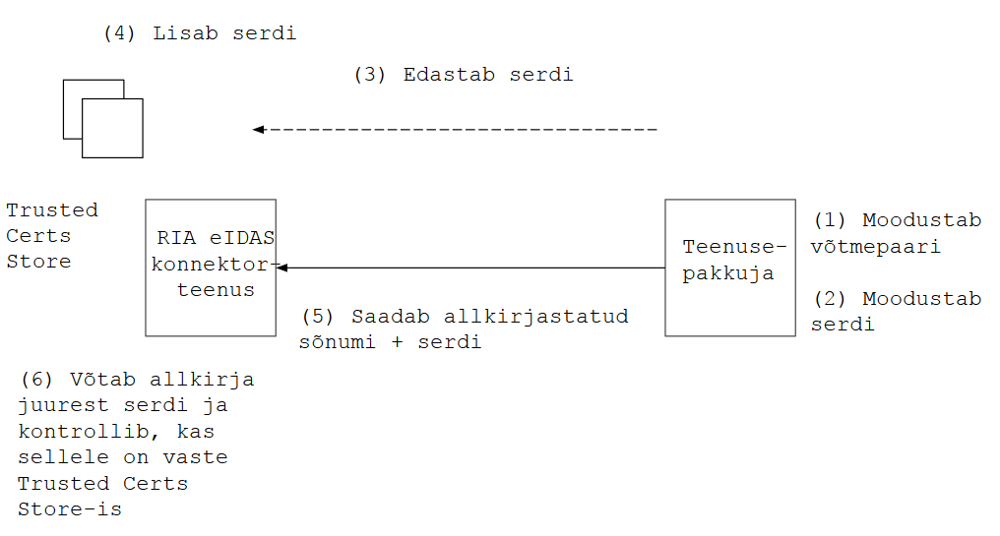

Märkus. Töödokument, mida ei ole kinnitatud.
{:.teade}

# eIDAS konnektorteenus. Usaldustoimingud
{: .no_toc}
v 0.1

- TOC
{:toc}

## Ülevaade

Käesolev spetsifikatsioon määratleb usaldus- ja võtmehalduse tehnilise lahenduse eIDAS konnektorteenuse siseriiklikes liidestes.

Spetsifikatsioon on kaasdokumendiks [eIDAS siseriiklikele usaldus- ja krüptonõuetele](Profiil). Spetsifikatsiooni stabiliseerudes dokumendid liidetakse.

## Vajadus

Süsteemis on vaja lahendada võtmehalduse (_Key Management_) ja "usaldusehaldus" (_Trust Management_) korraldus. Lahendus peab olema:
- piisavalt turvaline
- dokumenteeritud
- osapooltele kommunikeeritud
- tarkvaras teostatav.

## Mõisted ja tähistused

- _usaldushaldus_, _Trust Management_ - sõnumivahetuse autentsuse saavutamisele suunatud toimingud, nii konnektorteenuse osutaja (RIA) kui ka teenusekasutaja (asutuse) poolel. Seotud, kuid mitte võrdne võtmehaldusega
- _võtmehaldus_, _Key Management_ - krüptograafiliste võtmetega seotud toimingud: loomine, edastamine, kasutamine jm - võtme kogu elukaare ulatuses
- _asutus_ - asutus, kelle süsteem konnektorteenust tarbib; kitsamalt - asutuse süsteemihaldur
- _RIA_ - siin: RIA süsteemihaldur vm töötaja, kes on volitatud paigaldustoiminguid tegema
- _Konnektorteenus_ - RIA taristus paigaldatud tarkvarasüsteem, kuulub eIDAS Node koosseisu
- _teenusepakkuja süsteem (Service Provider, SP) - asutuse süsteem, mis tarbib konnektorteenust ja osutab e-teenust kasutajale
- _usaldushoidla_ - RIA konnektorteenuse juures peetav usaldatavate sertide hoidla (_Trusted Certs Store_). Tehniliselt teostatud Java Keystore vms abil
- _sõnum_ - teenusepakkuja süsteemi poolt konnektorteenusele saadetav SAML sõnum; sisaldab autentimispäringut 

_allkirja valideerimine_ - sisaldab kolme sammu: 
    - allkirja vormingu valideerimine. Kontroll, et allkiri vastab XML ja SAML-allkirja vormingule. 
    - _krüptograafiline valideerimine_. Kasutades allkirja juures olevat serti, kontrollitakse, et allkiri on tõepoolest moodustatud serdis sisalduvale avalikule võtmele vastava privaatvõtmega. Sellega saadakse kindlus, et allkirjastatud sõnumit ei ole muudetud. Krüptograafilisest valideerimisest ei piisa, vt _usaldatavuse kontrollimine_.
    - _usaldatavuse kontrollimine_. Kontrollitakse, et allkirjastamisel kasutatud võti on usaldatav. 

## Piirangud

Olulised piirangud:
1. eIDAS Node-i tarkvara ümbertegemist või täiendamist tahame võimalikult vältida.
    - Märkus. Põhimõtteliselt on see võimalik, mingist hetkest võimalik, et ka vältimatu. Kuid _fork_-i tegemine tõstab hüppeliselt tarkvara hoolduskulusid.
2. *eIDAS Node-i tarkvaras praegu ei ole teostatud usaldusahela kontrolli*.
    - Kontrollitakse, kas sert sisaldub usaldushoidlas ja see on kõik.
3. eIDAS Node-is võtme- ja usaldushaldusega tegelevaid komponente saab *sõlmede omavaheliseks ja siseriiklikuks suhtluseks erinevalt seadistada ainult piiratud ulatuses*.
    - Eraldi võtmehalduslahenduse tegemine siseriiklikuks ja Node-to-Node suhtluseks võib tähendada Node-i tarkvara olulist muutmist.

## Toimingud

Ettevalmistavad toimingud (usalduse loomine)

nr | Osapool | Tegevus | Selgitus
1  | Asutus  | Moodustab metateabe allkirjastamise võtmepaari |
2  | Asutus  | Moodustab metateabe allkirjastamise serdi |
3  | Asutus  | Moodustab sõnumi allkirjastamise võtmepaari |
4  | Asutus  | Moodustab sõnumi allkirjastamise serdi |
5  | Asutus  | Lisab moodustatud serdid oma süsteemi seadistusse |
6  | Teenusepakkuja süsteem | Genereerib seadistuse põhjal metateabe | SAML-vomingus XML-fail on teenusepakkuja metateabe otspunktist kättesaadav 
7  | Asutus | Edastab metateabe allkirjastamise serdi RIA-le | Edastatakse turvalise _out of band_ kanali kaudu. Edastuse korraldus lepitakse kokku otsesuhtluses RIA ja Asutuse vahel
8  | RIA   | Lisab metateabe allkirjastamise serdi usaldushoidlasse

Sõnumivahetuse usaldustoimingud

nr | Osapool | Tegevus | Selgitus
9  | Teenusepakkuja süsteem | Koostab sõnumi | Lisab sõnumisse (`Issuer` elementi) metateabe otspunkti URL-i
10  | Teenusepakkuja süsteem | Allkirjastab sõnumi. Sõnumile lisab sõnumi allkirjastamise serdi  | Kasutab sõnumi allkirjastamise privaatvõtit
11 | Teenusepakkuja süsteem | Edastab allkirjastatud sõnumi konnektorteenusele |
12 | Konnektorteenus | Teeb metateabe krüptograafilise valideerimise | Saab kindluse, et allkirjastatud metateavet ei ole muudetud
13 | Konnektorteenus | Võtab sõnumist teenusepakkuja metateabe URL-i ja laeb alla  metateabe | Kasutades puhverdamist. Puhverdamist tüüritakse konnektorteenuse seadistusparameetriga `nonDistributedMetadata.retention` ja teenusepakkuja metateabe parameetriga `validUntil`
14 | Konnektorteenus | Teeb metateabe krüptograafilise valideerimise | Saab kindluse, et allkirjastatud metateavet ei ole muudetud
15 | Konnektorteenus | Kontrollib metateabe allkirjastamisel kasutatud võtme usaldatavust | Võrdleb metateabe allkirjastamise serti usaldushoidla sertidega. Allkirjastamise sert peab sisalduma usaldushoidlas
16 | Konnektorteenus | Võtab metateabest sõnumi allkirjastamise serdi | Võib puhverdada
17 | Konnektorteenus | Kontrollib sõnumi allkirjastamisel kasutatud võtme usaldatavust | Võrdleb metateabe allkirjastamise serti usaldushoidla sertidega. Allkirjastamise sert peab sisalduma usaldushoidlas
  | | LÕPP. Sõnumi usaldatavus on kontrollitud |

Ülevaade toimingutest on esitatud joonisel 1.

Joonis 1

## Kirjandus

Metoodika. Teatud (üpris üldisi) juhiseid saab väljaannetest:
- NIST 800-130 (2013) [A Framework for Designing Cryptographic Key Management Systems](http://nvlpubs.nist.gov/nistpubs/SpecialPublications/NIST.SP.800-130.pdf)
- NIST 800-57 Key Management Guidelines (2016)
    - [Part 1 Recommendation for Key Management](http://nvlpubs.nist.gov/nistpubs/SpecialPublications/NIST.SP.800-57pt1r4.pdf)
    - [Part 2 Best Practices for Key Management Organization](https://csrc.nist.gov/publications/detail/sp/800-57-part-2/final)
- vt ka [A Profile for U.S. Federal Cryptographic Key Management Systems](http://nvlpubs.nist.gov/nistpubs/SpecialPublications/NIST.SP.800-152.pdf)
