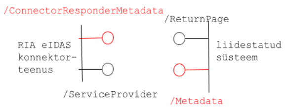

# Usaldusprofiil

## Mida on vaja?

Usaldusmehhanismi (_trust establishment mechanism_) RIA eIDAS konnektorteenuse ja liidestuva süsteemi (SAML terminoloogias - teenusepakkuja) vahel, mis mahub piirangutesse:

- konnektorteenuse tarkvara ei saa praktiliselt muuta, ainult seadistada
- sobib kõigile teenusepakkujatele (teadaolevalt RIK, EMTA, KEMIT, TEHIK)
    - nii halduse lihtsuse seisukohalt
    - kui ka seetõttu, et konnektorteenuses ei saa metaandmete laadimist erinevate teenusepakkujate jaoks lahendada erinevalt (kõigile p.o üks kahest: kas otspunkti või lokaalsest failist laadimine)
- ei piirdu üldiste määratlustega “vastavale eIDASele”, “vastavalt RIA krüptoalgo-de uuringule”, “vastavalt SAML-le” jne
- arvestab võimaliku tulevikuvajadusega krüptoalgoritme vahetada
- on programmeerija poolt u 1 nädalaga teostatav (teenusepakkuja liideses)

Siin räägime SAML sõnumivahetusest. TLS turvamine on eraldi kiht.

Selleks:

- tuleb anda täpsed juhised, mida teenusepakkuja oma SAML metateabes peab kirja panema 
- anda täiendavad juhised, kuidas teenusepakkuja konnektorteenuse SAML metateavet peab tõlgendama.
- leppida kokku, milliseid krüptoalgoritme kasutatakse
    - sh nõuded võtmepikkustele
- leppida kokku nõuded sertidele
    - väljaandja v usaldusankur
    - tüüp
    - kehtivusparameetrid
    - nõuded konkreetsetele elementidele (konnektorteenus ei aktsepteeri muidu)
- metateabe transpordi viis
- metateabe uuendamisse puutuv

## Ettepanekud

- metateabe transport
    - konnektorteenuse metateabe publitseeritakse HTTPS otspunktis:
        - https://eidastest.eesti.ee/EidasNode/ConnectorMetadata (testkeskkond)
        - https://eidas.eesti.ee/EidasNode/ConnectorMetadata (toodangukeskkond)
    - teenusepakkuja publitseerib metateabe samuti HTTPS otspunktis
        - teatab otspunkti RIA-le
    - soovi korral annab osapool (tulemüüriga) juurdepääsu metateabele ainult partnerile
- metateabe allkirjastamine
    - on kohustuslik
    - allkirja tuleb metateabe võtmisel valideerida
    - usaldusankruks SK ID Solutions AS juursert
- metateabe uuendamine
    - md:EntityDescriptor atribuudi validUntil abil
    - minimaalne validUntil väärtus - ? 
- serdid
    - usaldusankruks SK ID Solutions AS juursert
- allkirjastamisalgoritm
    - ettepanek on, et  lepime kokku 1 peamise ja 1 alternatiivse
- krüpteerimisalgoritm
    - ettepanek on, et  lepime kokku 1 peamise ja 1 alternatiivse

## Teenusepakkuja metateabe nõutav struktuur

## Otspunktid

Joonisel 1 on kujutatud liidestuva süsteemi seisukohalt olulised metateabe ja SAML-sõnumite vastuvõtu otspunktid:

- RIA eIDAS konnektorteenuse
    - metateabe otspunkt `/ConnectorResponderMetadata`
    - SAML autentimispäringsõnumite vastuvõtupunkt `/ServiceProvider`
- teenusepakkuja
    - metateabe otspunkt `/Metadata`
    - SAML autentimisvastussõnumite vastuvõtupunkt `/ReturnPage`.

Kõigi otspunktide URL-id on seadistatavad.

Joonis 1. Metateabe otspunktid (punasega) ja SAML sõnumite vastuvõtupunktid

## Sõnumivahetuse ülevaade

Konnektorteenus määrab oma metateabega milliseid algoritme ta toetab (algoritmid määratakse ära konfiguratsioonifailis). Liidestujad peavad selle info arvesse võtma.

Teenusepakkuja metadata kirjeldab milliseid algoritme tema ise SAML sõnumit vastu võttes toetab.

Autentimispäringu töötlemisel: 
1. Teenusepakkuja teeb enne SAML autentimispäringsõnumi koostamist päringu konnektorteenuse metaandmete otspunkti `/ConnectorResponderMetadata` (või kasutab puhverdatud metateavet).
2. Teenusepakkuja valib allkirjastamisalgoritmi, konnektorteenuse metadata alusel (peab olema üks neist, mis on toodud konnektorteenuse metadatas).
3. Teenusepakkuja allkirjastab autentimispäringu oma privaatvõtmega.
4. Teenusepakkuja saadab SAML autentimispäringsõnumi konnektorteenuse otspunkti `/ServiceProvider` (sirviku ümbersuunamisega).
5. Konnektorteenus teeb päringu Teenusepakkuja metaandmete otspunkti `/Metadata` (või kasutab puhverdatud metateavet).
6. Konnektorteenus otsustab, kas ta usaldab saatjat (kas tulnud päringu sees olev allkirja võti kuulub ka tegelikult saatjaga seotud metateabesse). Konnektorteenus valideerib `SAMLRequest` päringu allkirja ainult juhul, kui see on moodustatud algoritmiga, mis on tema lubatud allkirjameetodite nimekirjas (sama nimekiri, mida ta reklaamib välja oma metadatas - konfis toodud kui whitelist). Muul juhul annab vea.

Autentimisvastuse töötlemisel:
7. Sihtriigi vahendusteenusest tulev päring võetakse vastu, kontrollitakse ärireeglite vastu ja moodustatakse uus vastus, mis on allkirjastatud konnektorteenuse enda privaatvõtmega. Allkirja algoritm otsustatakse konnektorteenuse seadetes oleva algoritmi alusel. (NB! TÄPSUSTADA!)
8. Konnektorteenus, enne SAML autentimisvastussõnumi saatmist, teeb päringu Teenusepakkuja metaandmete otspunkti `/Metadata`.
9. Konnektorteenus saadab SAML autentimisvastussõnumi Teenusepakkujai otspunkti `/ReturnPage`.
10. Teenusepakkuja teeb päringu konnektorteenuse metaandmete otspunkti `/ConnectorResponderMetadata` (sarnaselt p 6).

## eIDAS konnektorteenuse metateave

Selgitame eIDAS konnektorteenuse poolt liidestuvale süsteemile pakutava metateabe tähendust.

- testteenus: [https://eidastest.eesti.ee/EidasNode/ConnectorResponderMetadata](https://eidastest.eesti.ee/EidasNode/ConnectorResponderMetadata) 
- toodangteeenus: [https://eidas.eesti.ee/EidasNode/ConnectorResponderMetadata](https://eidas.eesti.ee/EidasNode/ConnectorResponderMetadata) 

- `md:EntityDescriptor` - kirjeldatud on SAML olem (entity)
    - `entityID` - nimega `https://eidastest.eesti.ee/EidasNode/ConnectorResponderMetadata`
    - `validUntil` - kirjeldus kehtib 24 h.

- `ds:Signature` - kirjeldus on allkirjastatud XML allkirjaga
    - `ds:CanonicalizationMethod` - kanoniseerimisalgoritm - `xml-exc-c14n`
    - `ds:SignatureMethod` - allkirjaalgoritm on `rsa-sha521`
    - `ds:Transform` - _enveloped signature_, algoritm `xml-exc-c14n`
    - `ds:DigestMethod` - räsialgoritm `xmlenc#sha512`
    - `ds:Digestvalue` - räsiväärtus
    - `ds:SignatureValue` - allkirjaväärtus
    - `ds:KeyInfo` - X509 sertifikaat

- `md: Extensions` - metaandmete publitseerija ja tarbija vahel kokkulepitud spetsiifilised metaandmed

- `alg:Digestmethod` - konnektorteenus toetab räsialgoritme
    - `http://www.w3.org/2001/04/xmldsig-more#sha384`
    - `http://www.w3.org/2001/04/xmlenc#sha512` 
    - `http://www.w3.org/2001/04/xmlenc#sha256`

- `alg:SigningMethod` - toetatavad allkirjaalgoritmid (8 tk)

- `md: IDPSSODescriptor` - “SSO võimekusega IdP” - kirjeldatava olemi “roll”
    - `WantAuthnRequestsSigned` - nõuab, et autentimispäringu sõnum p.o allkirjastatud
    - `protocolSupportEnumeration` - ütleb, et toetab SAML 2.0-i

- `md:KeyDescriptor` - avaldab konnektorteenuse sertifikaadid ja kirjeldab toetatavad krüpteerimisalgoritmid
    - `signing` > `KeyInfo` - allkirjastamissertifikaat
    - `encryption` > `KeyInfo` - krüpteerimissertifikaat

- `md:EncryptionMethod` - toetatavad algoritmid
    - `http://www.w3.org/2009/xmlenc11#aes192-gcm`
    - `http://www.w3.org/2009/xmlenc11#aes256-gcm` 
    - `http://www.w3.org/2009/xmlenc11#aes128-gcm` 

- `md:NameIDFormat` - siin saab täpsemalt määratleda andmetevorminguid ja töötlusreegleid 
    - `persistent` - jääb arusaamatuks, kuid vt http://docs.oasis-open.org/security/saml/v2.0/saml-core-2.0-os.pdf, jaotis 8.3.7
    - `transient` - jääb arusaamatuks, kuid vt http://docs.oasis-open.org/security/saml/v2.0/saml-core-2.0-os.pdf, jaotis 8.3.8
    - `unspecified` - “tähenduseta” element, vt http://docs.oasis-open.org/security/saml/v2.0/saml-core-2.0-os.pdf, jaotis 8.3.1

- `md:SingleSignOnService`
atribuutidega `Binding` ja `Location` määratakse, et konnektorteenus võtab SAML sõnumeid vastu URL-il `https://eidastest.eesti.ee/EidasNode/ServiceProvider` ja saatmisviisiks on kas `HTTP-POST` või `HTTP-Redirect`

- `saml2:Attribute`
atribuutidega `FriendlyName`, `Name` ja `Nameformat` kirjeldatakse eIDAS atribuudid, mida konnektorteenuse kaudu saab küsida (40+)

- `md:Organization` - teave RIA kohta

- `md:ContactPerson` - teave teenuse kontaktisiku kohta.

vt ka [Metadata seletus](https://e-gov.github.io/eIDAS-Connector/MetadataSeletus#eidas-konnektorteenus-suhtluses-siseriikliku-liidestatud-s%C3%BCsteemiga), jaotis "Konnektorteenus suhtluses siseriikliku liidestatud süsteemiga".

## Märkused

1 Usaldusse puutuv SAML tasemel tuleks võimalikult ära määrata SAML metateabega, vt [SAML V2.0 Metadata Interoperability Profile v1.0](http://docs.oasis-open.org/security/saml/Post2.0/sstc-metadata-iop-cs-01.html) (2009). Samas tuleb olla realistlik: dünaamilist algoritmide kokkuleppimist e kätlust poolte vahel SAML standardid ei konkretiseeri. Me ei jõuaks ka teostada. Vrdl [SAML v2.0 Metadata Profile for Algorithm Support Version 1.0](http://docs.oasis-open.org/security/saml/Post2.0/sstc-saml-metadata-algsupport.html).

2 Vrdl Soome avaliku sektori keskse autentimisteenuse Suomi.fi-tunnistus juhised teenusepakkujate SAML metateabele: [https://esuomi.fi/palveluntarjoajille/tunnistus/tekninen-aineisto/asiointipalvelun-metadatatiedot/](https://esuomi.fi/palveluntarjoajille/tunnistus/tekninen-aineisto/asiointipalvelun-metadatatiedot/).

3 Alternatiiv: teenusepakkuja metateabe loetakse konnektorteenusesse sisse lokaalsest failist. See eeldab metateabe out of band (muu kanali kaudu) toimetamist RIA-sse.

