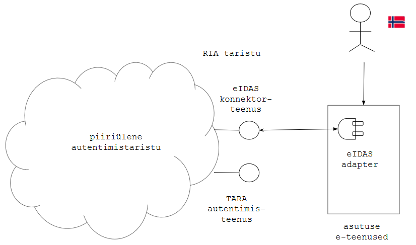
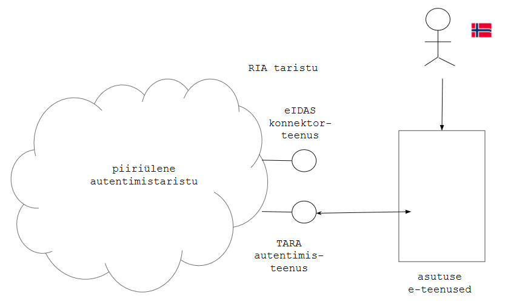

# Liidestamismeetodi valik

Välismaalase autentimiseks e-teenuses on vaja e-teenust pakkuv infosüsteem liidestada piiriülese autentimise e eIDAS-taristuga. Selleks on kaks võimalust:

- liidestada RIA eIDAS konnektorteenusega
- liidestada autentimisteenusega TARA.

|      |   ___eIDAS konnektorteenus___     |   __TARA___     |
|------|-----------------------------------|-----------------|
| sobib asutusele: | kellel juba on oma autentimislahendus ja soovib sellele lisada eIDAS-võimekuse | kes soovib välise teenuse abil lahendada nii piiriülese kui ka siseriikliku autentimise |
| autentimismeetoditena pakub: | välisriikide kodanike autentimine | ID-kaart, m-ID, alates kevadest 2018 ka välisriikide kodanike autentimine |
| sessioonihaldus: | ei paku | ei paku |
| liidestusprotokoll põhineb: | SAML 2 | OpenID Connect |
| adaptertarkvara: | - | jah |    

## Liidestamine RIA eIDAS konnektorteenusega

___RIA eIDAS konnektorteenus___ on pääsupunkt Euroopa Liidu piiriülesesse autentimistaristusse (nn eIDAS-taristusse).

 Vt lähemalt [https://e-gov.github.io/eIDAS-Connector/](https://e-gov.github.io/eIDAS-Connector/).

## Liidestamine autentimisteenusega TARA

___TARA___ on teenus, millega asutus saab oma e-teenuses autentida ID-kaardi või mobiil-ID kasutaja, alates kevadest 2018 ka välisriigi kasutaja.

 Vt lähemalt [https://e-gov.github.io/TARA-Doku/](https://e-gov.github.io/TARA-Doku/).