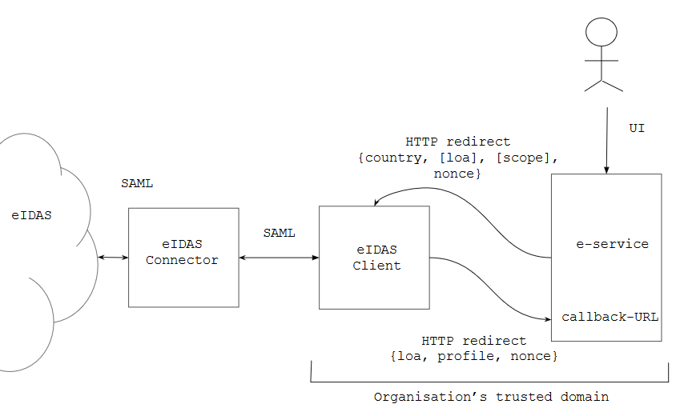

# eIDAS Client

- out-of-the-box solution to eIDAS integration problem
- connect to eIDAS cross-border authentication infrastructure
- greatly reduce integration costs
- minimal or no programming needed

### To whom?

All organisations, public or private, who wish to securely log on customers from EU countries.

### How does it work?

eIDAS Client sits between eIDAS infrastructure and your e-service (see figure)
- talking SAML towards eIDAS Connector 
- and extremely simple HTTPS/JSON towards your e-service

1  Your e-service sends the User to eIDAS Adapter

HTTPS Redirect, with parameters:
- `country` - code of the country the User wants to authenticate from
- `loa` (optional) - requested level of assurance (`high`, `medium` or `low`)
    - by default, `high` is assumed 
- `scope` (optional)
  - names of attributes of the User that your e-service requests
  - by default, eIDAS minimum set (PersonIdentifier, FirstName, FamilyName, DateOfBirth) is assumed
- `nonce` - random value, to protect against replay attacks
  - if needed, can help retain session in your e-service

2  eIDAS Client sends authenticated User back to your e-service

HTTPS Redirect (using automatic POST) to pre-configured callback-URL, with parameters:
- `loa` - actual level of assurance
- `profile` - attribute set of the authenticated User
- `nonce` - value reflected from the request

### Features

------|:-----:|-----------
Session management | Not needed | eIDAS Client is session- and stateless. There is no need to keep state, because eIDAS Client serves only one e-service and returning Users are always forwarded to the same callback-URL of the e-service. 
Security | Yes | eIDAS Client and e-service share the trusted domain of the organisation. 
Clustering | Yes | Sessionless eIDAS Client can be installed in any number of instances.

### How eIDAS Client reduces costs?

- no need to implement SAML interface
- extremely simple HTTP/JSON flow 
- sensible defaults for Level of Assurance and eIDAS attribute requests
- preconfigured SAML interface to eIDAS Connector

### Next steps

- Find a eIDAS Connector service provider. Every EU country has one (or more)
- download eIDAS Client software [https://github.com/e-gov/eIDAS-Client](https://github.com/e-gov/eIDAS-Client)
- connect eIDAS Client to eIDAS Connector (simple config)
- connect eIDAS Client to your e-service (implement HTTPS/JSON Redirect and Callback)

